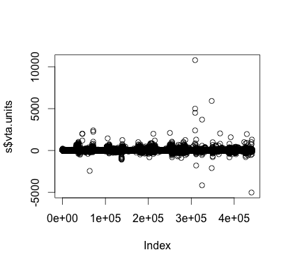
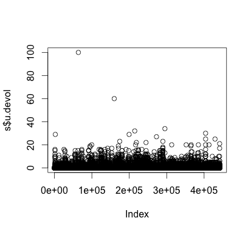
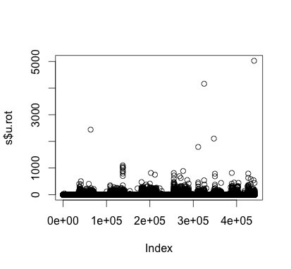
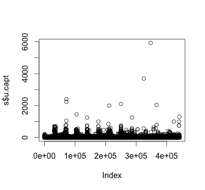
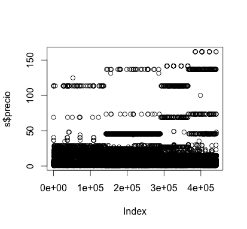

% 25-sept-2013
% Exploración del primer micro conjunto de datos que tenemos de pepsi.
% Makefile: pandoc -s -V geometry:margin=0.7in -V lang=spanish 1_exploratorio.md -o Exploratorio.pdf

Archivos
--------------------------------------------------------------------------------------------------
  - Dcd : Info de clientes. 99+1 variables
- Indcli: Archivo resumen del cliente en el día. 32+1 variables
- Indpro: Archivo x producto, x cliente, x ruta de las cosas vendidas o no. Este es el archivo +imp. 17+1 cols
- Indtie: Info de las horas. 7+1 campos

Indpro
--------------------------------------------------------------------------------------------------
  
  En este archivo están las ventas o no-ventas por producto. R sí cacha bien las 18 columnas, que son:
  
  Nombre original | Nombre nuestro  | Descripción
--------------- | --------------- | ----------------------------
  PRO_CLAVE       | prod.id         |   clave del producto
CLI_CLAVE        | cliente         |   clave del cliente corporativa; pa q sea id, concatenar con sucursal
RUT_CLAVE	      | ruta.id         |   clave de ruta corporativa
ID_SUC	        | centro.id       |   sucursal corporativa; centro de distribución de papitas
FECHA_TRANS	    | fecha.trans     |   fecha de la transacción (cuando le venden papitas)
FECHA_CARGA	    | fecha.carga     |   fecha en que se esta realizando la carga (cuando sale camionetita)
COM_CLAVE	      | cia.id          |   clave de compañía INASE: sabritas (1), quaker...
DHP_IMPORTE	    | vta.impo        |   Venta Real  importe
DHP_UNIDADES	  | vta.units       |   Venta Real unidades
BAN_VTA	        | dummy.vta       |   Bandera que indica si el producto tuvo venta o no
DHP_INVINI	    | invent.0        |   Inventario Inicial
DHP_UNIDEV	    | u.devol         |   Unidades devueltas
DHP_UNIROT	    | u.rot           |   Unidades rotadas
DHP_UNICAP	    | u.capt          |   Unidades Capturadas
DHP_UNISUG	    | u.sug           |   Unidades Sugeridas
DHP_UNIFAL	    | u.falt          |   Unidades Faltantes
DHP_PRECTE	    | precio          |   Precio Cliente


```{r,eval=FALSE}
setwd("/Users/PandoraMac/Documents/David/pepsi2/Datos_R/")
nombres<-c("carpeta","prod.id","cliente","ruta.id","centro.id","fecha.trans","fecha.carga","cia.id","vta.imp","vta.units","dummy.vta","invent.0","u.devol","u.rot","u.capt","u.sug", "u.falt","precio")
s<-as.data.frame(read.table("R_indpro.txt.mod", sep="|",header=FALSE,
                            colClasses=c(rep("character",8),"numeric",rep("integer",8),"numeric")))
names(s)<-nombres
head(s)

carpeta prod.id    cliente  ruta.id centro.id fecha.trans fecha.carga cia.id vta.imp vta.units dummy.vta
1 A3490435  695012 I000015919    0001       349  2013-04-18  2013-04-18     30   17.52         3         1
2 A3490435  065713 I000015919    0001       349  2013-04-18  2013-04-18     30   10.84         2         1
3 A3490435  017315 I000015919    0001       349  2013-04-18  2013-04-18     30   16.26         3         1
4 A3490435  583201 I000015919    0001       349  2013-04-18  2013-04-18     30    6.09         1         1
5 A3490435  357231 I000015919    0001       349  2013-04-18  2013-04-18     30    5.83         1         1
6 A3490435  637023 I000015919    0001       349  2013-04-18  2013-04-18     30   12.50         2         1
invent.0 u.devol u.rot u.capt u.sug u.falt precio
1       NA       0     0      3     0      0   5.84
2       NA       0     0      2     0      0   5.42
3       NA       0     0      3     0      0   5.42
4       NA       0     0      1     0      0   6.09
5       NA       0     0      1     0      0   5.83
6       NA       0     0      2     0      0   6.25
```


Primero, filtramos por compañía:
  ```{r,eval=FALSE}
> table(s$cia.id)

1     10     11     14      2      3     30     31 
442155     68   2177    514  53385  14507  65986  11627 

s<-subset(s,s$cia.id=="1")
```

La cía 1 es Sabritas. Así que sólo tenemos 442K transacciones.


Tables simples
-------------------------------------------------------------------------------------------------------
  
  - carpeta
- prod.id. poquitos productos tienen más de 5K registros. 
```{r,eval=FALSE}
> length(table(s$prod.id))
[1] 710
> min(table(s$prod.id))
[1] 1
> max(table(s$prod.id))
[1] 16317
> sum(table(s$prod.id)>5000) #sólo de sabritas son los productos con más de 5000 ventas, btw
[1] 38
> sum(table(s$prod.id<10))
[1] 442155
```

- cliente.id. Nos dijeron que la clave del cliente cambia con el centro de distribución, así que:
  ```{r,eval=FALSE}
> head(table(s$cliente,s$centro.id))

454  759
I000000001  8110 2755
I000000002 17647 9203
I000000007     4    0
I000000008     0    6
I000000017     1    0
I000000018    85    0
> nrow(s) #totales, eran 590419
[1] 442155
> length(paste(s$centro.id,s$cliente.id))
[1] 442155
s$cliente.id<-paste(s$cliente,s$centro.id,sep="-")
```

- ruta.id
```{r,eval=FALSE}
> length(table(s$ruta.id)) #383 en total... la mayoría son de papitas
[1] 230
> plot(table(s$ruta.id))
```


- centro.id
```{r,eval=FALSE}
> table(s$centro.id) #en los datos originales hay oootro centro, que no distribuye papitas

454    759 
289823 152332 
```

- fecha.trans, fecha.carga
Transferencia <= carga

- vta.imp
```{r,eval=FALSE}
summary(s$vta.imp)
Min.   1st Qu.    Median      Mean   3rd Qu.      Max.      NAs 
-33860.00     20.24     29.50     41.93     47.20  89530.00      5189 

#hist(s$vta.imp)
```

Hay muchos negativos. Habrá que ver q onda con ellos.


- vta.units
```{r,eval=FALSE}
summary(s$vta.units)
Min.   1st Qu.    Median      Mean   3rd Qu.      Max.      NAs 
-5024.000     4.000     5.000     7.728     9.000 10800.000      4951 

plot(s$vta.units)
```



- dummy.vta
```{r,eval=FALSE}
table(s$dummy.vta)
0      1 
7364 434791 
```

El $2\%$ no fue venta... 

- invent.0
summary(s$vta.units)
```{r,eval=FALSE}
> summary(s$invent.0)
Min. 1st Qu.  Median    Mean 3rd Qu.    Max.    NAs 
NA      NA      NA     NaN      NA      NA  442155 
```

- u.devol
```{r,eval=FALSE}
summary(s$u.devol)
Min. 1st Qu.  Median    Mean 3rd Qu.    Max.    NAs 
0.000   0.000   0.000   0.025   0.000 100.000   27432 
plot(s$u.devol)
```



"u.rot"
```{r,eval=FALSE}
summary(s$u.rot)
Min.  1st Qu.   Median     Mean  3rd Qu.     Max.     NAs 
0.000    0.000    0.000    0.891    0.000 5024.000    15458 
plot(s$u.rot)
```



- u.capt
```{r,eval=FALSE}
summary(s$u.capt)
Min.  1st Qu.   Median     Mean  3rd Qu.     Max.     NAs 
0.000    4.000    5.000    7.643    9.000 5921.000    26854 
plot(s$u.capt)
```



- u.sug
```{r,eval=FALSE}
summary(s$u.sug)
Min. 1st Qu.  Median    Mean 3rd Qu.    Max.    NAs 
0       0       0       0       0       0   27590 
```

- u.falt
```{r,eval=FALSE}
summary(s$u.falt)
Min. 1st Qu.  Median    Mean 3rd Qu.    Max.    NAs 
0       0       0       0       0       0   27590 
```

- precio
```{r,eval=FALSE}
summary(s$precio)
Min. 1st Qu.  Median    Mean 3rd Qu.    Max.    NAs 
0.43    4.22    5.06    6.12    5.90  161.80   31945 
plot(s$precio)
```




Tables dobles
-------------------------------------------------------------------------------------------------------
  
```{r,eval=FALSE}
setwd("/Users/PandoraMac/Documents/David/pepsi2/Datos_R/")
nombres2<-c("carpeta","cliente","ruta.id","centro.id","fecha.trans","fecha.carga","cia.id",
            "cap.cliente", "vta.imp","vta.units","vta.pop","vis.prog","vis.prog.real","vis.real","vis.efe",
            "vis.scan","vis.tot.scan","vis.no.vta","vis.no.real","vis.svta.min","vis.svm.imp","n.dinero",
            "n.cerrado","n.lleno","n.no.ta","n.mto","n.sv.sv","time.aten","time.trans","vis/ejec",
            "vis/ttras","hora.llega","hora.sale")
t<-as.data.frame(read.table("R_indcli.txt.mod", sep="|",header=FALSE,
                            colClasses=c(rep("character",6),rep("numeric",14),rep("character",8),
                                         rep("numeric",2),"character","character")))
names(t)<-nombres2
head(t)

carpeta    cliente ruta.id centro.id fecha.trans fecha.carga cia.id cap.cliente vta.imp vta.units vta.pop
1 A3490435 I000000001    0006       349  2013-04-18  2013-04-18     30           0  166.96         2       0
2 A3490435 I000000001    0009       349  2013-04-18  2013-04-18     30           0 2859.67       421       0
3 A3490435 I000000001    0022       349  2013-04-18  2013-04-18     30           0  560.70        92       0
4 A3490435 I000000001    0034       349  2013-04-18  2013-04-18     30           0  692.82       138       0
5 A3490435 I000000001    0037       349  2013-04-18  2013-04-18     30           0  289.52        48       0
6 A3490435 I000000001    0042       349  2013-04-18  2013-04-18     30           0  233.23        34       0
vis.prog vis.prog.real vis.real vis.efe vis.scan vis.tot.scan vis.no.vta vis.no.real vis.svta.min vis.svm.imp
1        0             0        1       1        0            0          0           0            0           0
2        0             0       13      13        0            0          0           0            0           0
3        0             0        1       1        0            0          0           0            0           0
4        0             0        4       4        0            0          0           0            0           0
5        0             0        2       2        0            0          0           0            0           0
6        0             0        1       1        0            0          0           0            0           0
n.dinero n.cerrado n.lleno n.no.ta n.mto n.sv.sv time.aten time.trans vis/ejec vis/ttras hora.llega hora.sale
1        0         0       0       0     0       0         0          0        0         0                     
2        0         0       0       0     0       0         0          0        0         0                     
3        0         0       0       0     0       0         0          0        0         0                     
4        0         0       0       0     0       0         0          0        0         0                     
5        0         0       0       0     0       0         0          0        0         0                     
6        0         0       0       0     0       0         0          0        0         0  
```

Volvemos a corregir lo del id de cliente y nos quedamos sólo con la cía 1
```{r,eval=FALSE}
t$cliente.id<-paste(t$cliente,t$centro.id,sep="-")
t<-subset(t,t$cia.id==1)
```

Son 38 K registros. Nos interesan las variables que empiezan con "n".
```{r,eval=FALSE}
for (i in c("n.dinero","n.cerrado","n.lleno","n.no.ta","n.mto","n.sv.sv")){
  cat(i)
  print(table(t[,i]))
}

n.dinero
    0     1 
37107   924 
n.cerrado
    0     1 
36941  1090 
n.lleno
    0     1 
37241   790 
n.no.ta
    0     1 
37940    91 
n.mto
    0 
38031 
n.sv.sv
    0     1 
36163  1868 
```

No hay nadie en mantenimiento, así que la omitiremos.

Tablas cruzadas:
```{r,eval=FALSE}
variables<-c("n.dinero","n.cerrado","n.lleno","n.no.ta","n.sv.sv")
table(t[,variables]) #borramos las tablas que están llenas de ceros

, , n.lleno = 0, n.no.ta = 0, n.sv.sv = 0

        n.cerrado
n.dinero     0     1
       0 33268  1090
       1   924     0

, , n.lleno = 1, n.no.ta = 0, n.sv.sv = 0

        n.cerrado
n.dinero     0     1
       0   790     0
       1     0     0

, , n.lleno = 0, n.no.ta = 1, n.sv.sv = 0

        n.cerrado
n.dinero     0     1
       0    91     0
       1     0     0

, , n.lleno = 0, n.no.ta = 0, n.sv.sv = 1

        n.cerrado
n.dinero     0     1
       0  1868     0
       1     0     0
```

En ningún caso se prenden dos banderas, je. Hagamos un subset para cada variable y vemos qué hay.
```{r,eval=FALSE}
variables<-c("n.dinero","n.cerrado","n.lleno","n.no.ta","n.sv.sv")
columnas<-c(4,12:21)
for(col in columnas)
{
  print(names(t)[col])
  x1<-table(t[t$n.dinero==1,col])/sum(table(t[t$n.dinero==1,col]))
  x2<-table(t[t$n.cerrado==1,col])/sum(table(t[t$n.cerrado==1,col]))
  x3<-table(t[t$n.lleno==1,col])/sum(table(t[t$n.lleno==1,col]))
  x4<-table(t[t$n.no.ta==1,col])/sum(table(t[t$n.no.ta==1,col]))
  x5<-table(t[t$n.sv.sv==1,col])/sum(table(t[t$n.sv.sv==1,col]))
  #noms<-c(names(x1),names(x2),names(x3),names(x4),names(x5))
  noms<-c(rep("din",nrow(x1)),rep("cerr",nrow(x2)),rep("lleno",nrow(x3)),
          rep("no.ta",nrow(x4)),rep("sv.sv",nrow(x5)))
  numeros<-c(x1,x2,x3,x4,x5)
  print(rbind(noms,round(numeros,3)))
  #print(numeros)
}  
```

En totales:
```{r,eval=FALSE}
[1] "centro.id"
        454   759   454    759    454     759     454     759     454     759    
noms    "din" "din" "cerr" "cerr" "lleno" "lleno" "no.ta" "no.ta" "sv.sv" "sv.sv"
numeros "611" "313" "645"  "445"  "639"   "151"   "72"    "19"    "1511"  "357"  
[1] "vis.prog"
        0     1     0      1      0       1       0       1       1      
noms    "din" "din" "cerr" "cerr" "lleno" "lleno" "no.ta" "no.ta" "sv.sv"
numeros "72"  "852" "13"   "1077" "124"   "666"   "13"    "78"    "1868" 
[1] "vis.prog.real"
        0     1     0      1      0       1       0       1       0       1      
noms    "din" "din" "cerr" "cerr" "lleno" "lleno" "no.ta" "no.ta" "sv.sv" "sv.sv"
numeros "142" "782" "224"  "866"  "217"   "573"   "29"    "62"    "1846"  "22"   
[1] "vis.real"
        0     1     0      1      0       1       0       1       0       1      
noms    "din" "din" "cerr" "cerr" "lleno" "lleno" "no.ta" "no.ta" "sv.sv" "sv.sv"
numeros "112" "812" "218"  "872"  "180"   "610"   "27"    "64"    "1846"  "22"   
[1] "vis.efe"
        0     0      0       0       0      
noms    "din" "cerr" "lleno" "no.ta" "sv.sv"
numeros "924" "1090" "790"   "91"    "1868" 
[1] "vis.scan"
        0     1     0      1      0       1       0       1       0       1      
noms    "din" "din" "cerr" "cerr" "lleno" "lleno" "no.ta" "no.ta" "sv.sv" "sv.sv"
numeros "112" "812" "218"  "872"  "180"   "610"   "27"    "64"    "1846"  "22"   
[1] "vis.tot.scan"
        0     1     0      1      0       1       0       1       0       1      
noms    "din" "din" "cerr" "cerr" "lleno" "lleno" "no.ta" "no.ta" "sv.sv" "sv.sv"
numeros "112" "812" "218"  "872"  "180"   "610"   "27"    "64"    "1846"  "22"   
[1] "vis.no.vta"
        1     1      1       1       1      
noms    "din" "cerr" "lleno" "no.ta" "sv.sv"
numeros "924" "1090" "790"   "91"    "1868" 
[1] "vis.no.real"
        0     0      0       0       0       1      
noms    "din" "cerr" "lleno" "no.ta" "sv.sv" "sv.sv"
numeros "924" "1090" "790"   "91"    "22"    "1846" 
[1] "vis.svta.min"
        0     0      0       0       0      
noms    "din" "cerr" "lleno" "no.ta" "sv.sv"
numeros "924" "1090" "790"   "91"    "1868" 
[1] "vis.svm.imp"
        0     0      0       0       0      
noms    "din" "cerr" "lleno" "no.ta" "sv.sv"
numeros "924" "1090" "790"   "91"    "1868" 
```

En porcentajes:
```{r,eval=FALSE}
[1] "centro.id"
     454     759     454     759     454     759     454     759     454     759    
noms "din"   "din"   "cerr"  "cerr"  "lleno" "lleno" "no.ta" "no.ta" "sv.sv" "sv.sv"
     "0.661" "0.339" "0.592" "0.408" "0.809" "0.191" "0.791" "0.209" "0.809" "0.191"

[1] "vis.prog"
     0       1       0       1       0       1       0       1       1      
noms "din"   "din"   "cerr"  "cerr"  "lleno" "lleno" "no.ta" "no.ta" "sv.sv"
     "0.078" "0.922" "0.012" "0.988" "0.157" "0.843" "0.143" "0.857" "1"    

[1] "vis.prog.real"
     0       1       0       1       0       1       0       1       0       1      
noms "din"   "din"   "cerr"  "cerr"  "lleno" "lleno" "no.ta" "no.ta" "sv.sv" "sv.sv"
     "0.154" "0.846" "0.206" "0.794" "0.275" "0.725" "0.319" "0.681" "0.988" "0.012"

[1] "vis.real"
     0       1       0      1      0       1       0       1       0       1      
noms "din"   "din"   "cerr" "cerr" "lleno" "lleno" "no.ta" "no.ta" "sv.sv" "sv.sv"
     "0.121" "0.879" "0.2"  "0.8"  "0.228" "0.772" "0.297" "0.703" "0.988" "0.012"

[1] "vis.efe"
     0     0      0       0       0      
noms "din" "cerr" "lleno" "no.ta" "sv.sv"
     "1"   "1"    "1"     "1"     "1"    

[1] "vis.scan"
     0       1       0      1      0       1       0       1       0       1      
noms "din"   "din"   "cerr" "cerr" "lleno" "lleno" "no.ta" "no.ta" "sv.sv" "sv.sv"
     "0.121" "0.879" "0.2"  "0.8"  "0.228" "0.772" "0.297" "0.703" "0.988" "0.012"

[1] "vis.tot.scan"
     0       1       0      1      0       1       0       1       0       1      
noms "din"   "din"   "cerr" "cerr" "lleno" "lleno" "no.ta" "no.ta" "sv.sv" "sv.sv"
     "0.121" "0.879" "0.2"  "0.8"  "0.228" "0.772" "0.297" "0.703" "0.988" "0.012"

[1] "vis.no.vta"
     1     1      1       1       1      
noms "din" "cerr" "lleno" "no.ta" "sv.sv"
     "1"   "1"    "1"     "1"     "1"    

[1] "vis.no.real"
     0     0      0       0       0       1      
noms "din" "cerr" "lleno" "no.ta" "sv.sv" "sv.sv"
     "1"   "1"    "1"     "1"     "0.012" "0.988"

[1] "vis.svta.min"
     0     0      0       0       0      
noms "din" "cerr" "lleno" "no.ta" "sv.sv"
     "1"   "1"    "1"     "1"     "1"    

[1] "vis.svm.imp"
     0     0      0       0       0      
noms "din" "cerr" "lleno" "no.ta" "sv.sv"
     "1"   "1"    "1"     "1"     "1"   
```


JOIN de INDCLI e INDPRO
-------------------------------------------------------------------------------------------------------

```{r,eval=FALSE}
setwd("/Users/PandoraMac/Documents/David/pepsi2/Datos_R/")
nombres<-c("carpeta","prod.id","cliente","ruta.id","centro.id","fecha.trans","fecha.carga","cia.id",
  "vta.imp","vta.units","dummy.vta","invent.0","u.devol","u.rot","u.capt","u.sug", "u.falt","precio")

s<-as.data.frame(read.table("R_indpro.txt.mod", sep="|",header=FALSE,
                            colClasses=c(rep("character",8),"numeric",rep("integer",8),"numeric")))

nombres2<-c("carpeta","cliente","ruta.id","centro.id","fecha.trans","fecha.carga","cia.id",
            "cap.cliente", "vta.imp","vta.units","vta.pop","vis.prog","vis.prog.real","vis.real","vis.efe",
            "vis.scan","vis.tot.scan","vis.no.vta","vis.no.real","vis.svta.min","vis.svm.imp","n.dinero",
            "n.cerrado","n.lleno","n.no.ta","n.mto","n.sv.sv","time.aten","time.trans","vis/ejec",
            "vis/ttras","hora.llega","hora.sale")

t<-as.data.frame(read.table("R_indcli.txt.mod", sep="|",header=FALSE,
                            colClasses=c(rep("character",6),rep("numeric",14),rep("character",8),
                                         rep("numeric",2),"character","character")))

names(s)<-nombres
names(t)<-nombres2
s$cliente.id<-paste(s$cliente,s$centro.id,sep="-")
s<-subset(s,s$cia.id==1)
t$cliente.id<-paste(t$cliente,t$centro.id,sep="-")
t<-subset(t,t$cia.id==1)
```


OJO: Qué onda con unidades capturadas y no sé qué tanto?
