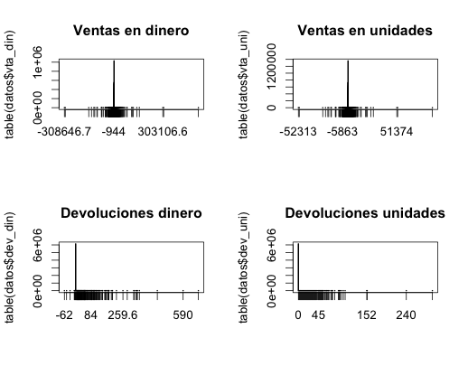
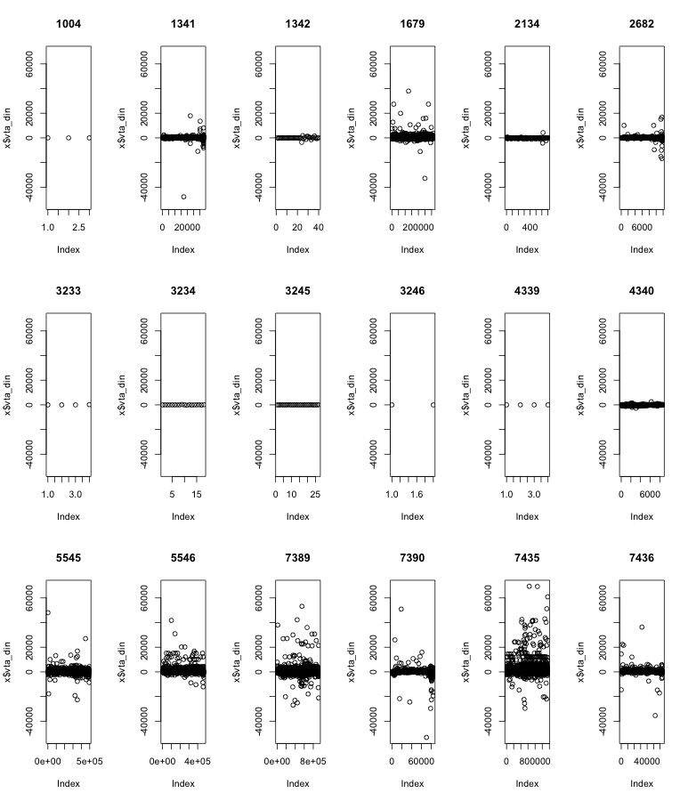

% 15-oct-2013
% Exploración del conjunto de datos que tenemos de la zona norte de pepsi.
% Makefile: pandoc -s -V geometry:margin=0.7in -V lang=spanish 1_exploratorio.md -o Exploratorio.pdf


Sólo vamos a utilizar los datos de SalesDataYYYYXXX.txt porque vamos a intentar aproximar inventarios.
Antes de hacer modelos para ver wtf, hay que ver si hay sobre o subdistribución. Pero antes, exploración de datos. David hizo una selección de tres productos: churrumais, fritos y papas normales.

**Las notas mentales están en negritas**


Prueba con sólo un archivo
--------------------------------------------------------------------------------------------------

- 1: CUSTKEY_CUSTNUMBER - 830I000000002
- 2: COD_BARRAS, - N/A todos
- 3: PRO.ID_PROD_ODS, - 0436
- 4: CALENDARDATE, - 2012-03-16
- 5: CURRENCY, - PESOS
- 6: MEDIDA, - EACH
- 7: VENTA_CAPT_PES, --> SALESAMOUNT – 1720.0000
- 8: VENTA_CAPT_UNI, --> SALESQUANTITY – 50.0000
- 9: DEVOL_PES, --> UNSALEABLEAMOUNT – 0.0000
- 10: DEVOL_UNI    --> UNSALEABLEQUANTITY  - 106
- 11: RUT.ID_RUTA

**Hay que borrar el campo 2 de código de barras; nomás estorba.**
**También el de moneda y medida, a menos que cambien**

Churrumais
--------------------------------------------------------------------------------------------------

```{r,eval=FALSE}
setwd("/Users/PandoraMac/Documents/David/pepsi2/Datos Norte 3 papitas/")
nombres<-c("id_cliente","codbarr","id_prod","fecha","moneda","medida","vta_din","vta_uni","dev_din",
           "dev_uni","id_ruta")
s<-as.data.frame(read.table("churrumais.dat", sep="|",header=FALSE,
                 colClasses=c(rep("character",6),rep("numeric",4),"integer")))
names(s)<-nombres
head(s)

     id_cliente codbarr id_prod      fecha moneda medida vta_din vta_uni dev_din dev_uni id_ruta
1 812I000006834     N/A    2134 2012-01-03  PESOS   EACH   37.95      15       0       0   20682
2 818I000005674     N/A    5545 2012-01-05  PESOS   EACH   30.33       9       0       0    3011
3 830I000000268     N/A    5545 2012-01-05  PESOS   EACH   33.70      10       0       0   12158
4 830I000001218     N/A    5545 2012-01-05  PESOS   EACH   67.40      20       0       0   14596
5 804I000002354     N/A    5545 2012-01-06  PESOS   EACH   16.85       5       0       0    8136
6 816I000008651     N/A    5545 2012-01-06  PESOS   EACH   33.70      10       0       0   11936

dim(s)
[1] 4044346      11
```


Plots:

```{r,eval=FALSE}
plot(table(s$vta_din))
plot(table(s$vta_uni))
plot(table(s$dev_din))
plot(table(s$dev_uni))
```





Tables simples
-------------------------------------------------------------------------------------------------------

```{r,eval=FALSE}
length(table(s$id_cliente))
[1] 127,488
length(table(s$codbarr))
[1] 1
length(table(s$id_prod))
[1] 24
length(table(s$fecha))
[1] 539
length(table(s$moneda))
[1] 1
length(table(s$medida))
[1] 1
length(table(s$id_ruta))
[1] 1902
> summary(s$vta_din)
     Min.   1st Qu.    Median      Mean   3rd Qu.      Max. 
-53170.00     13.48     21.10     28.60     33.70  69430.00 
> summary(s$vta_uni)
      Min.    1st Qu.     Median       Mean    3rd Qu.       Max. 
-14190.000      4.000      5.000      7.504      8.000  16450.000 
> summary(s$dev_din)
    Min.  1st Qu.   Median     Mean  3rd Qu.     Max. 
   0.000    0.000    0.000    0.055    0.000 4398.000 
> summary(s$dev_uni)
     Min.   1st Qu.    Median      Mean   3rd Qu.      Max. 
   0.0000    0.0000    0.0000    0.0189    0.0000 1305.0000 
```

**Ventas negativas!?!?**

**Para esto quizá tampoco necesitemos las rutas; en bash podríamos tbn quitar esa columna**

**Tenemos todos los sku's que corresponden a churrumais. Necesito ver que sean todos chicos**


Verificación de SKUs
-------------------------------------------------------------------------------------------------------

```{r,eval=FALSE}
#setwd("/Users/PandoraMac/Documents/David/pepsi2/Datos Norte 3 papitas/")
#nombres<-c("id_cliente","codbarr","id_prod","fecha","moneda","medida","vta_din","vta_uni","dev_din",
#           "dev_uni","id_ruta")
#s<-as.data.frame(read.table("churrumais.dat", sep="|",header=FALSE,
                 colClasses=c(rep("character",6),rep("numeric",4),"integer")))
#names(s)<-nombres

prod<-as.data.frame(read.table("productos_sal.txt", sep="|", quote="", header=FALSE,fill=TRUE,stringsAsFactors = FALSE,colClasses=rep("character",8)))
datos<-subset(s,is.element(s$id_prod,prod[,2]))
dim(datos)
[1] 4044346      11
dim(prod)
[1] 3086    8
rm(s)
#sort(table(datos$id_prod),decreasing=TRUE)[1:20]
subset(prod,V2%in%names(sort(table(datos$id_prod),decreasing=TRUE)))
      V1   V2            V3 V4    V5 V6         V7                V8
245  N/A 3245 SAVORY SNACKS  2 CHICO 93 CHURRUMAIS        CHURRUMAIS
246  N/A 3246 SAVORY SNACKS  2 CHICO 93 CHURRUMAIS        CHURRUMAIS
288  N/A 1679 SAVORY SNACKS  2 CHICO 93 CHURRUMAIS        CHURRUMAIS
366  N/A 5545 SAVORY SNACKS  2 CHICO 93 CHURRUMAIS        CHURRUMAIS
438  N/A 5546 SAVORY SNACKS  2 CHICO 93 CHURRUMAIS        CHURRUMAIS
486  N/A 7389 SAVORY SNACKS  2 CHICO 93 CHURRUMAIS        CHURRUMAIS
540  N/A 7390 SAVORY SNACKS  2 CHICO 93 CHURRUMAIS        CHURRUMAIS
548  N/A 7435 SAVORY SNACKS  2 CHICO 93 CHURRUMAIS        CHURRUMAIS
728  N/A 1341 SAVORY SNACKS  2 CHICO 93 CHURRUMAIS        CHURRUMAIS
729  N/A 1342 SAVORY SNACKS  2 CHICO 93 CHURRUMAIS        CHURRUMAIS
1167 N/A 3234 SAVORY SNACKS  2 CHICO 93 CHURRUMAIS        CHURRUMAIS
1292 N/A 2682 SAVORY SNACKS  2 CHICO 93 CHURRUMAIS        CHURRUMAIS
1304 N/A 1344 SAVORY SNACKS  2 CHICO 93 CHURRUMAIS CHURRUMAIS FLAMAS
1695 N/A 4597 SAVORY SNACKS  2 CHICO 93 CHURRUMAIS CHURRUMAIS FLAMAS
1879 N/A 7436 SAVORY SNACKS  2 CHICO 93 CHURRUMAIS        CHURRUMAIS
2115 N/A 4340 SAVORY SNACKS  2 CHICO 93 CHURRUMAIS        CHURRUMAIS
2117 N/A 4339 SAVORY SNACKS  2 CHICO 93 CHURRUMAIS        CHURRUMAIS
2292 N/A 1004 SAVORY SNACKS  2 CHICO 93 CHURRUMAIS        CHURRUMAIS
2599 N/A 3233 SAVORY SNACKS  2 CHICO 93 CHURRUMAIS        CHURRUMAIS
2677 N/A 2134 SAVORY SNACKS  2 CHICO 93 CHURRUMAIS        CHURRUMAIS
2853 N/A 1343 SAVORY SNACKS  2 CHICO 93 CHURRUMAIS CHURRUMAIS FLAMAS
3071 N/A 4607 SAVORY SNACKS  2 CHICO 93 CHURRUMAIS CHURRUMAIS FLAMAS
3072 N/A 4622 SAVORY SNACKS  2 CHICO 93 CHURRUMAIS CHURRUMAIS FLAMAS
3080 N/A 4576 SAVORY SNACKS  2 CHICO 93 CHURRUMAIS CHURRUMAIS FLAMAS
```

Hay que matar los churrumais flamas: c(1344,4597,1343,4607,4622,4576)
```{r,eval=FALSE}
datos<- subset(s,id_prod %in% c("3245","3246","1679","5545","5546","7389","7390","7435","1341","1342","3234","2682","7436","4340","4339","1004","3233","2134"))
```

Plots de las ventas y devoluciones versus las otras cosas

```{r,eval=FALSE}
length(table(datos$id_prod))
[1] 18
par(mfrow=c(3,8))
myfunction<-function(x){
  plot(x$vta_din,ylim=c(min(datos$vta_din),max(datos$vta_din)),main=x$id_prod[1])
}
by(datos,datos$id_prod,myfunction)
par(mfrow=c(1,1))
```


