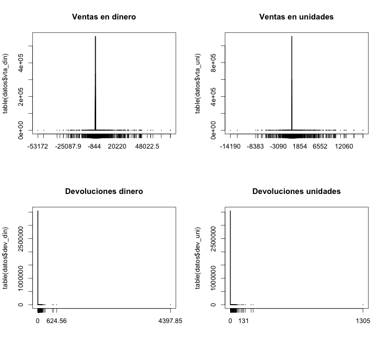
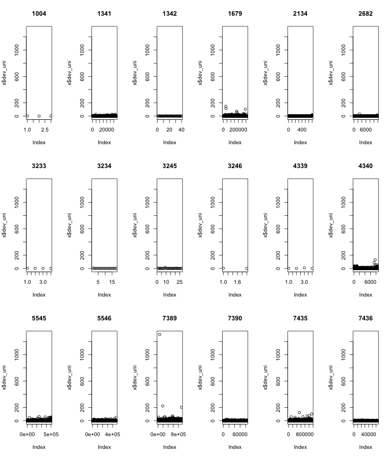
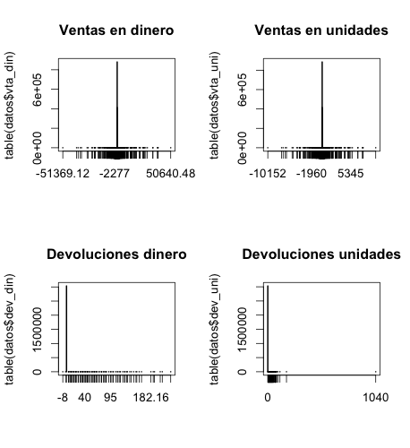
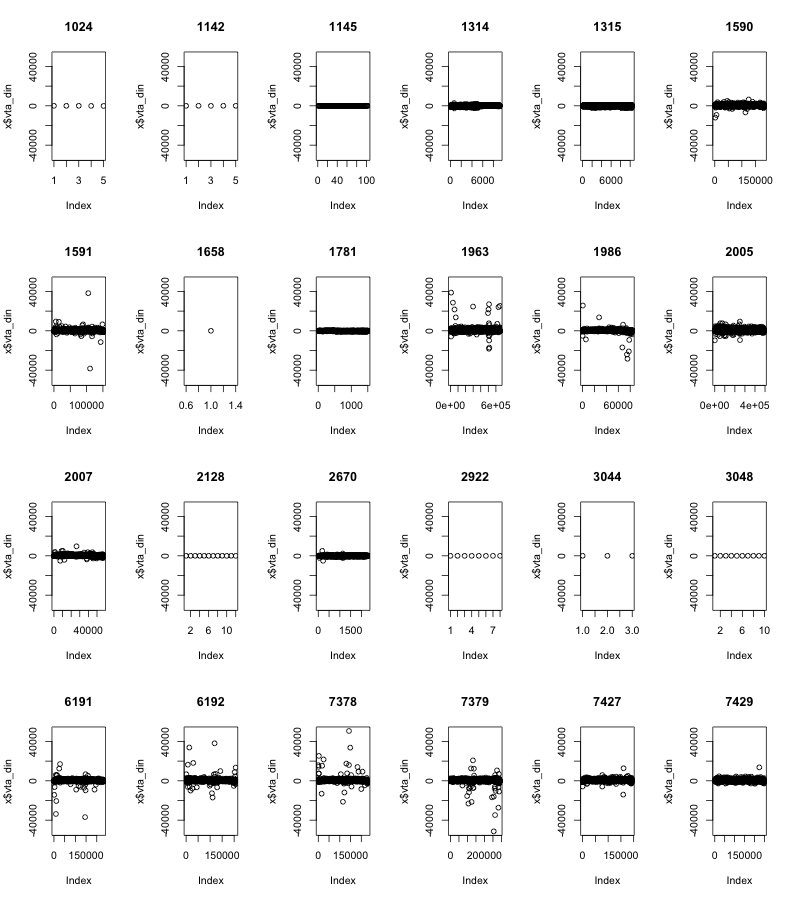
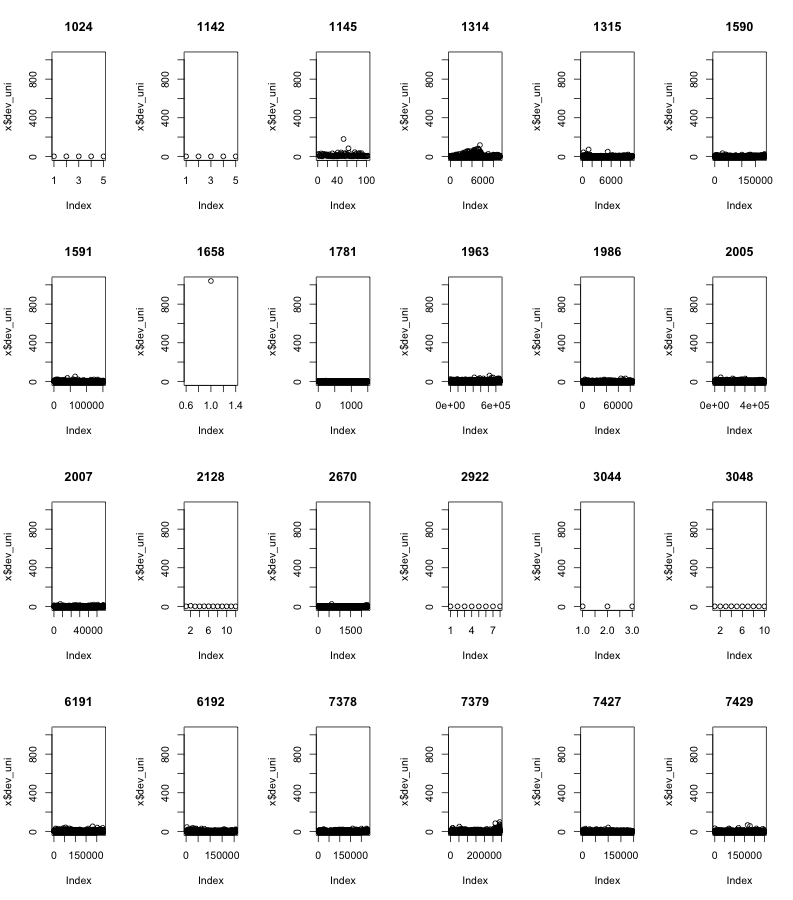
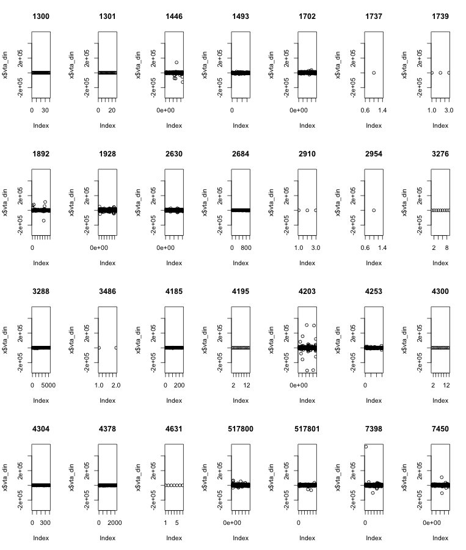
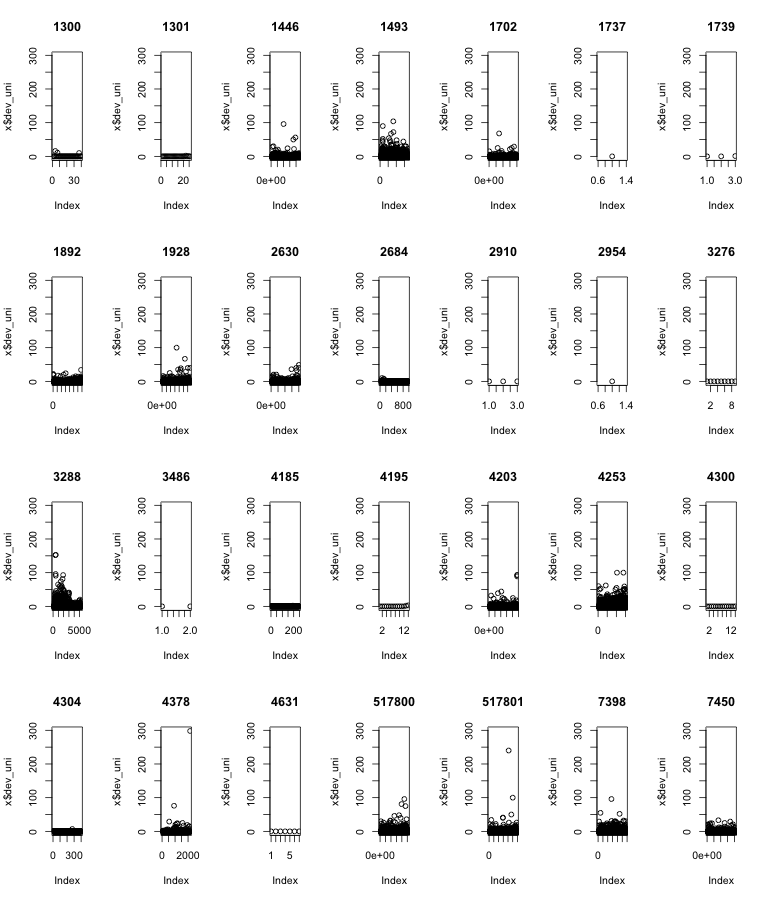

% 17-oct-2013
% Exploración del conjunto de datos que tenemos de la zona norte de pepsi.
% Makefile: pandoc -s -V geometry:margin=0.7in -V lang=spanish 1_exploratorio.md -o Exploratorio.pdf

A partir de los datos en los archivos SalesDataYYYYXXX.txt, seleccionamos Fritos, Churrumais y las
sabritas normales. Se tienen tres archivos con las transacciones que corresponden a esos 
tres cositos pero hay sku's colados. En este documento se generan fritos2, churrumais2 y papas2,
que son las versiones sin sku's colados. Además, se producen graficas de ventas en lana y devoluciones
en unidades para los distintos sku's que forman un solo producto.


Variables de los archivos SALESbloblo
--------------------------------------------------------------------------------------------------

- 1: CUSTKEY_CUSTNUMBER - 830I000000002
- 2: COD_BARRAS, - N/A todos
- 3: PRO.ID_PROD_ODS, - 0436
- 4: CALENDARDATE, - 2012-03-16
- 5: CURRENCY, - PESOS
- 6: MEDIDA, - EACH
- 7: VENTA_CAPT_PES, --> SALESAMOUNT – 1720.0000
- 8: VENTA_CAPT_UNI, --> SALESQUANTITY – 50.0000
- 9: DEVOL_PES, --> UNSALEABLEAMOUNT – 0.0000
- 10: DEVOL_UNI    --> UNSALEABLEQUANTITY  - 106
- 11: RUT.ID_RUTA

**Hay que borrar el campo 2 de código de barras; nomás estorba.**
**También el de moneda y medida, a menos que cambien. No cambian. Lo verificamos con los tables más adelante**

Churrumais
--------------------------------------------------------------------------------------------------

```{r,eval=FALSE}
setwd("/Users/PandoraMac/Documents/David/pepsi2/Datos Norte 3 papitas/")
nombres<-c("id_cliente","codbarr","id_prod","fecha","moneda","medida","vta_din","vta_uni","dev_din",
           "dev_uni","id_ruta")
s<-as.data.frame(read.table("churrumais.dat", sep="|",header=FALSE,
                 colClasses=c(rep("character",6),rep("numeric",4),"integer")))
names(s)<-nombres
head(s)

     id_cliente codbarr id_prod      fecha moneda medida vta_din vta_uni dev_din dev_uni id_ruta
1 812I000006834     N/A    2134 2012-01-03  PESOS   EACH   37.95      15       0       0   20682
2 818I000005674     N/A    5545 2012-01-05  PESOS   EACH   30.33       9       0       0    3011
3 830I000000268     N/A    5545 2012-01-05  PESOS   EACH   33.70      10       0       0   12158
4 830I000001218     N/A    5545 2012-01-05  PESOS   EACH   67.40      20       0       0   14596
5 804I000002354     N/A    5545 2012-01-06  PESOS   EACH   16.85       5       0       0    8136
6 816I000008651     N/A    5545 2012-01-06  PESOS   EACH   33.70      10       0       0   11936

dim(s)
[1] 4044346      11
```

Verificación de SKUs
-------------------------------------------------------------------------------------------------------
**Tenemos todos los sku's que corresponden a churrumais. Necesito ver que sean todos chicos**

```{r,eval=FALSE}
#setwd("/Users/PandoraMac/Documents/David/pepsi2/Datos Norte 3 papitas/")
#nombres<-c("id_cliente","codbarr","id_prod","fecha","moneda","medida","vta_din","vta_uni","dev_din",
#           "dev_uni","id_ruta")
#s<-as.data.frame(read.table("churrumais.dat", sep="|",header=FALSE,
#                 colClasses=c(rep("character",6),rep("numeric",4),"integer")))
#names(s)<-nombres

prod<-as.data.frame(read.table("productos_sal.txt", sep="|", quote="", header=FALSE,fill=TRUE,stringsAsFactors = FALSE,colClasses=rep("character",8)))

dim(prod)
[1] 3086    8

subset(prod,V2%in%names(sort(table(s$id_prod),decreasing=TRUE)))
      V1   V2            V3 V4    V5 V6         V7                V8
245  N/A 3245 SAVORY SNACKS  2 CHICO 93 CHURRUMAIS        CHURRUMAIS
246  N/A 3246 SAVORY SNACKS  2 CHICO 93 CHURRUMAIS        CHURRUMAIS
288  N/A 1679 SAVORY SNACKS  2 CHICO 93 CHURRUMAIS        CHURRUMAIS
366  N/A 5545 SAVORY SNACKS  2 CHICO 93 CHURRUMAIS        CHURRUMAIS
438  N/A 5546 SAVORY SNACKS  2 CHICO 93 CHURRUMAIS        CHURRUMAIS
486  N/A 7389 SAVORY SNACKS  2 CHICO 93 CHURRUMAIS        CHURRUMAIS
540  N/A 7390 SAVORY SNACKS  2 CHICO 93 CHURRUMAIS        CHURRUMAIS
548  N/A 7435 SAVORY SNACKS  2 CHICO 93 CHURRUMAIS        CHURRUMAIS
728  N/A 1341 SAVORY SNACKS  2 CHICO 93 CHURRUMAIS        CHURRUMAIS
729  N/A 1342 SAVORY SNACKS  2 CHICO 93 CHURRUMAIS        CHURRUMAIS
1167 N/A 3234 SAVORY SNACKS  2 CHICO 93 CHURRUMAIS        CHURRUMAIS
1292 N/A 2682 SAVORY SNACKS  2 CHICO 93 CHURRUMAIS        CHURRUMAIS
1304 N/A 1344 SAVORY SNACKS  2 CHICO 93 CHURRUMAIS CHURRUMAIS FLAMAS
1695 N/A 4597 SAVORY SNACKS  2 CHICO 93 CHURRUMAIS CHURRUMAIS FLAMAS
1879 N/A 7436 SAVORY SNACKS  2 CHICO 93 CHURRUMAIS        CHURRUMAIS
2115 N/A 4340 SAVORY SNACKS  2 CHICO 93 CHURRUMAIS        CHURRUMAIS
2117 N/A 4339 SAVORY SNACKS  2 CHICO 93 CHURRUMAIS        CHURRUMAIS
2292 N/A 1004 SAVORY SNACKS  2 CHICO 93 CHURRUMAIS        CHURRUMAIS
2599 N/A 3233 SAVORY SNACKS  2 CHICO 93 CHURRUMAIS        CHURRUMAIS
2677 N/A 2134 SAVORY SNACKS  2 CHICO 93 CHURRUMAIS        CHURRUMAIS
2853 N/A 1343 SAVORY SNACKS  2 CHICO 93 CHURRUMAIS CHURRUMAIS FLAMAS
3071 N/A 4607 SAVORY SNACKS  2 CHICO 93 CHURRUMAIS CHURRUMAIS FLAMAS
3072 N/A 4622 SAVORY SNACKS  2 CHICO 93 CHURRUMAIS CHURRUMAIS FLAMAS
3080 N/A 4576 SAVORY SNACKS  2 CHICO 93 CHURRUMAIS CHURRUMAIS FLAMAS
```

Hay que matar los churrumais flamas: c(1344,4597,1343,4607,4622,4576)
```{r,eval=FALSE}
datos<- subset(s,id_prod%in% c("3245","3246","1679","5545","5546","7389","7390","7435","1341","1342","3234","2682","7436","4340","4339","1004","3233","2134"))
write.table(datos,"churrumais2.dat",sep="|",row.names = FALSE,col.names =FALSE)
rm(s)
```


Tables y plots
-------------------------------------------------------------------------------------------------------

```{r,eval=FALSE}
length(table(datos$id_cliente))
[1] 124,764
length(table(datos$codbarr))
[1] 1
length(table(datos$id_prod))
[1] 18
length(table(datos$fecha))
[1] 539
length(table(datos$moneda))
[1] 1
length(table(datos$medida))
[1] 1
length(table(datos$id_ruta))
[1] 1898
> summary(datos$vta_din)
     Min.   1st Qu.    Median      Mean   3rd Qu.      Max. 
-53170.00     16.85     21.10     29.97     33.70  69430.00 
> summary(datos$vta_uni)
      Min.    1st Qu.     Median       Mean    3rd Qu.       Max. 
-14190.000      4.000      5.000      7.926      9.000  16450.000 
> summary(datos$dev_din)
    Min.  1st Qu.   Median     Mean  3rd Qu.     Max. 
   0.000    0.000    0.000    0.041    0.000 4398.000 
> summary(datos$dev_uni)
     Min.   1st Qu.    Median      Mean   3rd Qu.      Max. 
   0.0000    0.0000    0.0000    0.0162    0.0000 1305.0000  
```

**Ventas negativas!?!?**

**Para esto quizá tampoco necesitemos las rutas; en bash podríamos tbn quitar esa columna**


Plots:

```{r,eval=FALSE}
par(mfrow=c(2,2))
plot(table(datos$vta_din),main="Ventas en dinero")
plot(table(datos$vta_uni),main="Ventas en unidades")
plot(table(datos$dev_din),main="Devoluciones dinero")
plot(table(datos$dev_uni),main="Devoluciones unidades")
par(mfrow=c(1,1))
```



Plots de las ventas y devoluciones versus las otras cosas

```{r,eval=FALSE}
par(mfrow=c(3,6))
myfunction<-function(x){
  plot(x$vta_din,ylim=c(min(datos$vta_din),max(datos$vta_din)),main=x$id_prod[1])
}
by(datos,datos$id_prod,myfunction)
par(mfrow=c(1,1))
```


```{r,eval=FALSE}
par(mfrow=c(3,6))
myfunction<-function(x){
  plot(x$dev_uni,ylim=c(min(datos$dev_uni),max(datos$dev_uni)),main=x$id_prod[1])
}
by(datos,datos$id_prod,myfunction)
par(mfrow=c(1,1))
```




Fritos
--------------------------------------------------------------------------------------------------

```{r,eval=FALSE}
setwd("/Users/PandoraMac/Documents/David/pepsi2/Datos Norte 3 papitas/")
nombres<-c("id_cliente","codbarr","id_prod","fecha","moneda","medida","vta_din","vta_uni","dev_din",
           "dev_uni","id_ruta")
s<-as.data.frame(read.table("fritos.dat", sep="|",header=FALSE,
                 colClasses=c(rep("character",6),rep("numeric",4),"integer")))
names(s)<-nombres
head(s)

     id_cliente codbarr id_prod      fecha moneda medida vta_din vta_uni dev_din dev_uni id_ruta
1 814I000000214     N/A    1314 2012-01-05  PESOS   EACH    5.06       1       0       0     860
2 814I000014599     N/A    1314 2012-01-03  PESOS   EACH   50.60      10       0       0    7064
3 845I000004658     N/A    1314 2011-12-31  PESOS   EACH   50.60      10       0       0   11883
4 825I000009614     N/A    1314 2012-01-03  PESOS   EACH   45.54       9       0       0    5071
5 811I000013776     N/A    1314 2012-01-04  PESOS   EACH   60.72      12       0       0    6923
6 824I000000786     N/A    1314 2012-01-03  PESOS   EACH   25.30       5       0       0    6130

dim(s)
[1] 3054426      11
```

Verificación de SKUs
-------------------------------------------------------------------------------------------------------
**Tenemos todos los sku's que corresponden a churrumais. Necesito ver que sean todos chicos**

```{r,eval=FALSE}
#setwd("/Users/PandoraMac/Documents/David/pepsi2/Datos Norte 3 papitas/")
#nombres<-c("id_cliente","codbarr","id_prod","fecha","moneda","medida","vta_din","vta_uni","dev_din",
#           "dev_uni","id_ruta")
#s<-as.data.frame(read.table("churrumais.dat", sep="|",header=FALSE,
#                 colClasses=c(rep("character",6),rep("numeric",4),"integer")))
#names(s)<-nombres

prod<-as.data.frame(read.table("productos_sal.txt", sep="|", quote="", header=FALSE,fill=TRUE,stringsAsFactors = FALSE,colClasses=rep("character",8)))

dim(prod)
[1] 3086    8

subset(prod,V2%in%names(sort(table(s$id_prod),decreasing=TRUE)))
      V1   V2            V3 V4    V5 V6         V7                V8
195  N/A 1145 SAVORY SNACKS  2 CHICO 93  FRITOS      FRITOS SAL
367  N/A 6192 SAVORY SNACKS  2 CHICO 93  FRITOS      FRITOS SAL
501  N/A 7427 SAVORY SNACKS  2 CHICO 93  FRITOS      FRITOS SAL
502  N/A 7434 SAVORY SNACKS  2 CHICO 93 DORITOS DORITOS INFERNO
536  N/A 7378 SAVORY SNACKS  2 CHICO 93  FRITOS      FRITOS SAL
537  N/A 7379 SAVORY SNACKS  2 CHICO 93  FRITOS      FRITOS SAL
545  N/A 7429 SAVORY SNACKS  2 CHICO 93  FRITOS      FRITOS SAL
645  N/A 1314 SAVORY SNACKS  2 CHICO 93  FRITOS      FRITOS SAL
661  N/A 1781 SAVORY SNACKS  2 CHICO 93  FRITOS      FRITOS SAL
842  N/A 3044 SAVORY SNACKS  2 CHICO 93  FRITOS      FRITOS SAL
844  N/A 3048 SAVORY SNACKS  2 CHICO 93  FRITOS      FRITOS SAL
1199 N/A 2128 SAVORY SNACKS  2 CHICO 93  FRITOS      FRITOS SAL
1217 N/A 1590 SAVORY SNACKS  2 CHICO 93  FRITOS      FRITOS SAL
1218 N/A 1591 SAVORY SNACKS  2 CHICO 93  FRITOS      FRITOS SAL
1282 N/A 2670 SAVORY SNACKS  2 CHICO 93  FRITOS      FRITOS SAL
1643 N/A 1024 SAVORY SNACKS  2 CHICO 93  FRITOS      FRITOS SAL
1750 N/A 2922 SAVORY SNACKS  2 CHICO 93  FRITOS      FRITOS SAL
1907 N/A 1986 SAVORY SNACKS  2 CHICO 93  FRITOS      FRITOS SAL
1910 N/A 2005 SAVORY SNACKS  2 CHICO 93  FRITOS      FRITOS SAL
1920 N/A 2007 SAVORY SNACKS  2 CHICO 93  FRITOS      FRITOS SAL
1928 N/A 1963 SAVORY SNACKS  2 CHICO 93  FRITOS      FRITOS SAL
2374 N/A 1142 SAVORY SNACKS  2 CHICO 93  FRITOS      FRITOS SAL
2639 N/A 6191 SAVORY SNACKS  2 CHICO 93  FRITOS      FRITOS SAL
2686 N/A 1315 SAVORY SNACKS  2 CHICO 93  FRITOS      FRITOS SAL
```

Hay que matar los doritos colados:
```{r,eval=FALSE}
datos<- s[s$id_prod!="7434",]
write.table(datos,"fritos2.dat",sep="|",row.names = FALSE,col.names =FALSE)
rm(s)
```


Tables y plots
-------------------------------------------------------------------------------------------------------

```{r,eval=FALSE}
length(table(datos$id_cliente))
[1] 120,153
length(table(datos$codbarr))
[1] 1
length(table(datos$id_prod))
[1] 24
length(table(datos$fecha))
[1] 539
length(table(datos$moneda))
[1] 1
length(table(datos$medida))
[1] 1
length(table(datos$id_ruta))
[1] 1881
> summary(datos$vta_din)
     Min.   1st Qu.    Median      Mean   3rd Qu.      Max. 
-51370.00     15.18     25.30     30.25     30.36  50640.00 
> summary(datos$vta_uni)
      Min.    1st Qu.     Median       Mean    3rd Qu.       Max. 
-10150.000      3.000      5.000      5.984      6.000  10010.000 
> summary(datos$dev_din)
     Min.   1st Qu.    Median      Mean   3rd Qu.      Max. 
 -8.00000   0.00000   0.00000   0.08582   0.00000 225.00000 
> summary(datos$dev_uni)
    Min.  1st Qu.   Median     Mean  3rd Qu.     Max. 
0.00e+00 0.00e+00 0.00e+00 2.66e-02 0.00e+00 1.04e+03 
```

**Ventas negativas!?!?**

**Para esto quizá tampoco necesitemos las rutas; en bash podríamos tbn quitar esa columna**


Plots:

```{r,eval=FALSE}
par(mfrow=c(2,2))
plot(table(datos$vta_din),main="Ventas en dinero")
plot(table(datos$vta_uni),main="Ventas en unidades")
plot(table(datos$dev_din),main="Devoluciones dinero")
plot(table(datos$dev_uni),main="Devoluciones unidades")
par(mfrow=c(1,1))
```



Plots de las ventas y devoluciones versus las otras cosas

```{r,eval=FALSE}
par(mfrow=c(4,6))
myfunction<-function(x){
  plot(x$vta_din,ylim=c(min(datos$vta_din),max(datos$vta_din)),main=x$id_prod[1])
}
by(datos,datos$id_prod,myfunction)
par(mfrow=c(1,1))
```



```{r,eval=FALSE}
par(mfrow=c(4,6))
myfunction<-function(x){
  plot(x$dev_uni,ylim=c(min(datos$dev_uni),max(datos$dev_uni)),main=x$id_prod[1])
}
by(datos,datos$id_prod,myfunction)
par(mfrow=c(1,1))
```




Sabritas normales
--------------------------------------------------------------------------------------------------

```{r,eval=FALSE}
setwd("/Users/PandoraMac/Documents/David/pepsi2/Datos Norte 3 papitas/")
nombres<-c("id_cliente","codbarr","id_prod","fecha","moneda","medida","vta_din","vta_uni","dev_din",
           "dev_uni","id_ruta")
s<-as.data.frame(read.table("papas.dat", sep="|",header=FALSE,
                 colClasses=c(rep("character",6),rep("numeric",4),"integer")))
names(s)<-nombres
head(s)

     id_cliente codbarr id_prod      fecha moneda medida vta_din vta_uni dev_din dev_uni id_ruta
1 813I000032259     N/A    4185 2012-01-04  PESOS   EACH    25.3       5       0       0   20411
2 807I000015685     N/A    4203 2012-01-02  PESOS   EACH    88.5      15       0       0    3908
3 808I000002399     N/A    4203 2012-01-04  PESOS   EACH    17.7       3       0       0    4738
4 807I000002468     N/A    4203 2012-01-06  PESOS   EACH    94.4      16       0       0   14158
5 816I000007644     N/A    4203 2012-01-06  PESOS   EACH    70.8      12       0       0    1361
6 821I000012272     N/A    4203 2012-01-02  PESOS   EACH    29.5       5       0       0   10936

dim(s)
[1] 6,139,556      11
```

Verificación de SKUs
-------------------------------------------------------------------------------------------------------
**Tenemos todos los sku's que corresponden a churrumais. Necesito ver que sean todos chicos**

```{r,eval=FALSE}
#setwd("/Users/PandoraMac/Documents/David/pepsi2/Datos Norte 3 papitas/")
#nombres<-c("id_cliente","codbarr","id_prod","fecha","moneda","medida","vta_din","vta_uni","dev_din",
#           "dev_uni","id_ruta")
#s<-as.data.frame(read.table("churrumais.dat", sep="|",header=FALSE,
#                 colClasses=c(rep("character",6),rep("numeric",4),"integer")))
#names(s)<-nombres

prod<-as.data.frame(read.table("productos_sal.txt", sep="|", quote="", header=FALSE,fill=TRUE,stringsAsFactors = FALSE,colClasses=rep("character",8)))

dim(prod)
[1] 3086    8

subset(prod,V2%in%names(sort(table(s$id_prod),decreasing=TRUE)))
145  N/A   5346 SAVORY SNACKS  2    TUBOTANA 129   CHEETOS BAKED          QUESABRITAS
261  N/A   3140 SAVORY SNACKS  2    COMPARTE  96      SABRITONES           SABRITONES
314  N/A   7328 SAVORY SNACKS  2       CHICO  93         DORITOS        DORITOS NACHO
333  N/A   7450 SAVORY SNACKS  2       CHICO  93     SABRITAS PC         SABRITAS SAL
334  N/A   7452 SAVORY SNACKS  2       CHICO  93     SABRITAS PC         SABRITAS SAL
337  N/A   6001 SAVORY SNACKS  2       CHICO  93         DORITOS        DORITOS NACHO
392  N/A   1633 SAVORY SNACKS  2 SALADO OTRO 121            DIPS          POWDER DIPS
393  N/A   1656 SAVORY SNACKS  2 SALADO OTRO 121            DIPS          POWDER DIPS
430  N/A   1121 SAVORY SNACKS  2       CHICO  93        TOSTITOS  TOSTITOS FLAMIN HOT
436  N/A   5347 SAVORY SNACKS  2       SHOTS 124   CHEETOS FRIED        CHEETOS SHOTS
437  N/A   5433 SAVORY SNACKS  2     DISPLAY  97        TOSTITOS TOSTITOS SALSA VERDE
458  N/A   4253 SAVORY SNACKS  2       CHICO  93     SABRITAS PC         SABRITAS SAL
488  N/A   7398 SAVORY SNACKS  2       CHICO  93     SABRITAS PC         SABRITAS SAL
502  N/A   7434 SAVORY SNACKS  2       CHICO  93         DORITOS      DORITOS INFERNO
532  N/A   7360 SAVORY SNACKS  2       CHICO  93     RANCHERITOS          RANCHERITOS
621  N/A   4378 SAVORY SNACKS  2       CHICO  93     SABRITAS PC         SABRITAS SAL
639  N/A   1300 SAVORY SNACKS  2       CHICO  93     SABRITAS PC         SABRITAS SAL
788  N/A   2954 SAVORY SNACKS  2       CHICO  93     SABRITAS PC         SABRITAS SAL
833  N/A   3030 SAVORY SNACKS  2       CHICO  93         DORITOS        DORITOS NACHO
967  N/A   1897 SAVORY SNACKS  2    TUBOTANA 129         DORITOS      DORITOS INFERNO
976  N/A   1928 SAVORY SNACKS  2       CHICO  93     SABRITAS PC         SABRITAS SAL
977  N/A   1702 SAVORY SNACKS  2       CHICO  93     SABRITAS PC         SABRITAS SAL
980  N/A   1929 SAVORY SNACKS  2       CHICO  93     SABRITAS PC    SABRITAS ADOBADAS
986  N/A   3214 SAVORY SNACKS  2         MAX 110     SABRITAS PC    SABRITAS ADOBADAS
1003 N/A   3500 SAVORY SNACKS  2         MAX 110     SABRITAS PC         SABRITAS SAL
1150 N/A   1435 SAVORY SNACKS  2       CHICO  93         DORITOS        DORITOS NACHO
1153 N/A   1451 SAVORY SNACKS  2    COMPARTE  96     RANCHERITOS          RANCHERITOS
1194 N/A   1446 SAVORY SNACKS  2       CHICO  93     SABRITAS PC         SABRITAS SAL
1222 N/A   2630 SAVORY SNACKS  2       CHICO  93     SABRITAS PC         SABRITAS SAL
1321 N/A   4300 SAVORY SNACKS  2       CHICO  93     SABRITAS PC         SABRITAS SAL
1379 N/A   1474 SAVORY SNACKS  2       CHICO  93        TOSTITOS    TOSTITOS CRONCHOS
1525 N/A   4185 SAVORY SNACKS  2       CHICO  93     SABRITAS PC         SABRITAS SAL
1531 N/A   4195 SAVORY SNACKS  2       CHICO  93     SABRITAS PC         SABRITAS SAL
1535 N/A   4203 SAVORY SNACKS  2       CHICO  93     SABRITAS PC         SABRITAS SAL
1707 N/A   3092 SAVORY SNACKS  2    COMPARTE  96   CHEETOS BAKED      CHEETOS BOLITAS
1727 N/A   3486 SAVORY SNACKS  2       CHICO  93     SABRITAS PC         SABRITAS SAL
1748 N/A   2910 SAVORY SNACKS  2       CHICO  93     SABRITAS PC         SABRITAS SAL
1788 N/A   4230 SAVORY SNACKS  2       CHICO  93       PORK RIND  CHICHARRON DE CERDO
1885 N/A   1084 SAVORY SNACKS  2       CHICO  93   CHEETOS FRIED   CHEETOS TORCIDITOS
1890 N/A   1470 SAVORY SNACKS  2    FAMILIAR 100        PAKETAXO             PAKETAXO
1917 N/A   2059 SAVORY SNACKS  2       CHICO  93         DORITOS        DORITOS NACHO
1978 N/A   3386 SAVORY SNACKS  2    COMPARTE  96     SABRITAS PC         SABRITAS SAL
2059 N/A   1493 SAVORY SNACKS  2       CHICO  93     SABRITAS PC         SABRITAS SAL
2071 N/A   3273 SAVORY SNACKS  2    COMPARTE  96         DORITOS        DORITOS NACHO
2106 N/A   4304 SAVORY SNACKS  2       CHICO  93     SABRITAS PC         SABRITAS SAL
2221 N/A   3112 SAVORY SNACKS  2    COMPARTE  96          FRITOS           FRITOS SAL
2224 N/A   3121 SAVORY SNACKS  2    FAMILIAR 100         RUFFLES        RUFFLES QUESO
2271 N/A   3288 SAVORY SNACKS  2       CHICO  93     SABRITAS PC         SABRITAS SAL
2604 N/A   1737 SAVORY SNACKS  2       CHICO  93     SABRITAS PC         SABRITAS SAL
2611 N/A   1563 SAVORY SNACKS  2    COMPARTE  96         RUFFLES        RUFFLES QUESO
2622 N/A   1411 SAVORY SNACKS  2       CHICO  93   CHEETOS BAKED        CHEETOS POFFS
2658 N/A   1739 SAVORY SNACKS  2       CHICO  93     SABRITAS PC         SABRITAS SAL
2680 N/A   1301 SAVORY SNACKS  2       CHICO  93     SABRITAS PC         SABRITAS SAL
2752 N/A   7318 SAVORY SNACKS  2       CHICO  93   CHEETOS FRIED   CHEETOS FLAMIN HOT
2753 N/A   7319 SAVORY SNACKS  2       CHICO  93   CHEETOS FRIED   CHEETOS FLAMIN HOT
2782 N/A   3276 SAVORY SNACKS  2       CHICO  93     SABRITAS PC         SABRITAS SAL
2822 N/A   1892 SAVORY SNACKS  2       CHICO  93     SABRITAS PC         SABRITAS SAL
2837 N/A   1608 SAVORY SNACKS  2    FAMILIAR 100     SABRITAS PC         SABRITAS SAL
2870 N/A   3391 SAVORY SNACKS  2    COMPARTE  96     SABRITAS PC    SABRITAS ADOBADAS
2874 N/A   2684 SAVORY SNACKS  2       CHICO  93     SABRITAS PC         SABRITAS SAL
2884 N/A   1337 SAVORY SNACKS  2       CHICO  93     RANCHERITOS          RANCHERITOS
2939 N/A 517801 SAVORY SNACKS  2       CHICO  93     SABRITAS PC         SABRITAS SAL
3025 N/A 517800 SAVORY SNACKS  2       CHICO  93     SABRITAS PC         SABRITAS SAL
3068 N/A   4623 SAVORY SNACKS  2       CHICO  94 CHEETOS POFFETS      CHEETOS POFFETS
3079 N/A   4631 SAVORY SNACKS  2       CHICO  93     SABRITAS PC         SABRITAS SAL
```

Hay que matar las papitas coladas: c(5346,3140,7328,6001,1633,1656,1121,5347,5433,7434,
  7360,3030,1897,1929,3214,3500,1435,1451,1474,3092,4230,1084,1470,2059,3273,3112,3121,
  1563,1411,7318,7319,339,1337,4623,3386,1608)

```{r,eval=FALSE}
145  N/A   5346 SAVORY SNACKS  2    TUBOTANA 129   CHEETOS BAKED          QUESABRITAS
261  N/A   3140 SAVORY SNACKS  2    COMPARTE  96      SABRITONES           SABRITONES
314  N/A   7328 SAVORY SNACKS  2       CHICO  93         DORITOS        DORITOS NACHO
337  N/A   6001 SAVORY SNACKS  2       CHICO  93         DORITOS        DORITOS NACHO
392  N/A   1633 SAVORY SNACKS  2 SALADO OTRO 121            DIPS          POWDER DIPS
393  N/A   1656 SAVORY SNACKS  2 SALADO OTRO 121            DIPS          POWDER DIPS
430  N/A   1121 SAVORY SNACKS  2       CHICO  93        TOSTITOS  TOSTITOS FLAMIN HOT
436  N/A   5347 SAVORY SNACKS  2       SHOTS 124   CHEETOS FRIED        CHEETOS SHOTS
437  N/A   5433 SAVORY SNACKS  2     DISPLAY  97        TOSTITOS TOSTITOS SALSA VERDE
502  N/A   7434 SAVORY SNACKS  2       CHICO  93         DORITOS      DORITOS INFERNO
532  N/A   7360 SAVORY SNACKS  2       CHICO  93     RANCHERITOS          RANCHERITOS
833  N/A   3030 SAVORY SNACKS  2       CHICO  93         DORITOS        DORITOS NACHO
967  N/A   1897 SAVORY SNACKS  2    TUBOTANA 129         DORITOS      DORITOS INFERNO
980  N/A   1929 SAVORY SNACKS  2       CHICO  93     SABRITAS PC    SABRITAS ADOBADAS
986  N/A   3214 SAVORY SNACKS  2         MAX 110     SABRITAS PC    SABRITAS ADOBADAS
1003 N/A   3500 SAVORY SNACKS  2         MAX 110     SABRITAS PC         SABRITAS SAL
1150 N/A   1435 SAVORY SNACKS  2       CHICO  93         DORITOS        DORITOS NACHO
1153 N/A   1451 SAVORY SNACKS  2    COMPARTE  96     RANCHERITOS          RANCHERITOS
1379 N/A   1474 SAVORY SNACKS  2       CHICO  93        TOSTITOS    TOSTITOS CRONCHOS
1707 N/A   3092 SAVORY SNACKS  2    COMPARTE  96   CHEETOS BAKED      CHEETOS BOLITAS
1788 N/A   4230 SAVORY SNACKS  2       CHICO  93       PORK RIND  CHICHARRON DE CERDO
1885 N/A   1084 SAVORY SNACKS  2       CHICO  93   CHEETOS FRIED   CHEETOS TORCIDITOS
1890 N/A   1470 SAVORY SNACKS  2    FAMILIAR 100        PAKETAXO             PAKETAXO
1917 N/A   2059 SAVORY SNACKS  2       CHICO  93         DORITOS        DORITOS NACHO
2071 N/A   3273 SAVORY SNACKS  2    COMPARTE  96         DORITOS        DORITOS NACHO
2221 N/A   3112 SAVORY SNACKS  2    COMPARTE  96          FRITOS           FRITOS SAL
2224 N/A   3121 SAVORY SNACKS  2    FAMILIAR 100         RUFFLES        RUFFLES QUESO
2611 N/A   1563 SAVORY SNACKS  2    COMPARTE  96         RUFFLES        RUFFLES QUESO
2622 N/A   1411 SAVORY SNACKS  2       CHICO  93   CHEETOS BAKED        CHEETOS POFFS
2752 N/A   7318 SAVORY SNACKS  2       CHICO  93   CHEETOS FRIED   CHEETOS FLAMIN HOT
2753 N/A   7319 SAVORY SNACKS  2       CHICO  93   CHEETOS FRIED   CHEETOS FLAMIN HOT
2870 N/A   3391 SAVORY SNACKS  2    COMPARTE  96     SABRITAS PC    SABRITAS ADOBADAS
2884 N/A   1337 SAVORY SNACKS  2       CHICO  93     RANCHERITOS          RANCHERITOS
3068 N/A   4623 SAVORY SNACKS  2       CHICO  94 CHEETOS POFFETS      CHEETOS POFFETS
1978 N/A   3386 SAVORY SNACKS  2    COMPARTE  96     SABRITAS PC         SABRITAS SAL
2837 N/A   1608 SAVORY SNACKS  2    FAMILIAR 100     SABRITAS PC         SABRITAS SAL
```

Las papitas buenas:
```{r,eval=FALSE}
333  N/A   7450 SAVORY SNACKS  2       CHICO  93     SABRITAS PC         SABRITAS SAL
334  N/A   7452 SAVORY SNACKS  2       CHICO  93     SABRITAS PC         SABRITAS SAL
458  N/A   4253 SAVORY SNACKS  2       CHICO  93     SABRITAS PC         SABRITAS SAL
488  N/A   7398 SAVORY SNACKS  2       CHICO  93     SABRITAS PC         SABRITAS SAL
621  N/A   4378 SAVORY SNACKS  2       CHICO  93     SABRITAS PC         SABRITAS SAL
639  N/A   1300 SAVORY SNACKS  2       CHICO  93     SABRITAS PC         SABRITAS SAL
788  N/A   2954 SAVORY SNACKS  2       CHICO  93     SABRITAS PC         SABRITAS SAL
976  N/A   1928 SAVORY SNACKS  2       CHICO  93     SABRITAS PC         SABRITAS SAL
977  N/A   1702 SAVORY SNACKS  2       CHICO  93     SABRITAS PC         SABRITAS SAL
1194 N/A   1446 SAVORY SNACKS  2       CHICO  93     SABRITAS PC         SABRITAS SAL
1222 N/A   2630 SAVORY SNACKS  2       CHICO  93     SABRITAS PC         SABRITAS SAL
1321 N/A   4300 SAVORY SNACKS  2       CHICO  93     SABRITAS PC         SABRITAS SAL
1525 N/A   4185 SAVORY SNACKS  2       CHICO  93     SABRITAS PC         SABRITAS SAL
1531 N/A   4195 SAVORY SNACKS  2       CHICO  93     SABRITAS PC         SABRITAS SAL
1535 N/A   4203 SAVORY SNACKS  2       CHICO  93     SABRITAS PC         SABRITAS SAL
1727 N/A   3486 SAVORY SNACKS  2       CHICO  93     SABRITAS PC         SABRITAS SAL
1748 N/A   2910 SAVORY SNACKS  2       CHICO  93     SABRITAS PC         SABRITAS SAL
2059 N/A   1493 SAVORY SNACKS  2       CHICO  93     SABRITAS PC         SABRITAS SAL
2106 N/A   4304 SAVORY SNACKS  2       CHICO  93     SABRITAS PC         SABRITAS SAL
2271 N/A   3288 SAVORY SNACKS  2       CHICO  93     SABRITAS PC         SABRITAS SAL
2604 N/A   1737 SAVORY SNACKS  2       CHICO  93     SABRITAS PC         SABRITAS SAL
2658 N/A   1739 SAVORY SNACKS  2       CHICO  93     SABRITAS PC         SABRITAS SAL
2680 N/A   1301 SAVORY SNACKS  2       CHICO  93     SABRITAS PC         SABRITAS SAL
2782 N/A   3276 SAVORY SNACKS  2       CHICO  93     SABRITAS PC         SABRITAS SAL
2822 N/A   1892 SAVORY SNACKS  2       CHICO  93     SABRITAS PC         SABRITAS SAL
2874 N/A   2684 SAVORY SNACKS  2       CHICO  93     SABRITAS PC         SABRITAS SAL
2939 N/A 517801 SAVORY SNACKS  2       CHICO  93     SABRITAS PC         SABRITAS SAL
3025 N/A 517800 SAVORY SNACKS  2       CHICO  93     SABRITAS PC         SABRITAS SAL
3079 N/A   4631 SAVORY SNACKS  2       CHICO  93     SABRITAS PC         SABRITAS SAL
```

Papitas buenas:c(7450,7452, 4253, 7398, 4378, 1300, 2954, 1928, 1702, 1446, 2630, 4300, 4185, 
4195, 4203, 3486, 2910, 1493, 4304, 3288, 1737, 1739, 1301, 3276, 1892,2684, 517801,517800,4631)


```{r,eval=FALSE}
datos<- subset(s,s$id_prod%in%c(7450,7452, 4253, 7398, 4378, 1300, 2954, 1928, 1702, 1446, 2630,
                                4300, 4185, 4195, 4203, 3486, 2910, 1493, 4304, 3288, 1737, 
                                1739,1301, 3276, 1892,2684, 517801,517800,4631))
write.table(datos,"papas2.dat",sep="|",row.names = FALSE,col.names =FALSE)
rm(s)
```


Tables y plots
-------------------------------------------------------------------------------------------------------

```{r,eval=FALSE}
length(table(datos$id_cliente))
[1] 133,223
length(table(datos$codbarr))
[1] 1
length(table(datos$id_prod))
[1] 29
length(table(datos$fecha))
[1] 539
length(table(datos$moneda))
[1] 1
length(table(datos$medida))
[1] 1
length(table(datos$id_ruta))
[1] 1986
> summary(datos$vta_din)
     Min.   1st Qu.    Median      Mean   3rd Qu.      Max. 
-308600.0      23.6      29.5      49.2      59.0  524400.0 
> summary(datos$vta_uni)
     Min.   1st Qu.    Median      Mean   3rd Qu.      Max. 
-52310.00      4.00      5.00      8.08     10.00  88880.00 
> summary(datos$dev_din)
    Min.  1st Qu.   Median     Mean  3rd Qu.     Max. 
-62.0000   0.0000   0.0000   0.0223   0.0000 674.0000 
> summary(datos$dev_uni)
    Min.  1st Qu.   Median     Mean  3rd Qu.     Max. 
0.00e+00 0.00e+00 0.00e+00 7.95e-03 0.00e+00 2.98e+02 
```

**Ventas negativas!?!? Tbn devoluciones negativas!!!**

**Para esto quizá tampoco necesitemos las rutas; en bash podríamos tbn quitar esa columna**


Plots:

```{r,eval=FALSE}
par(mfrow=c(2,2))
plot(table(datos$vta_din),main="Ventas en dinero")
plot(table(datos$vta_uni),main="Ventas en unidades")
plot(table(datos$dev_din),main="Devoluciones dinero")
plot(table(datos$dev_uni),main="Devoluciones unidades")
par(mfrow=c(1,1))
```


Plots de las ventas y devoluciones versus las otras cosas

```{r,eval=FALSE}
par(mfrow=c(4,7))
myfunction<-function(x){
  plot(x$vta_din,ylim=c(min(datos$vta_din),max(datos$vta_din)),main=x$id_prod[1])
}
by(datos,datos$id_prod,myfunction)
par(mfrow=c(1,1))
```



```{r,eval=FALSE}
par(mfrow=c(4,7))
myfunction<-function(x){
  plot(x$dev_uni,ylim=c(min(datos$dev_uni),max(datos$dev_uni)),main=x$id_prod[1])
}
by(datos,datos$id_prod,myfunction)
par(mfrow=c(1,1))
```


