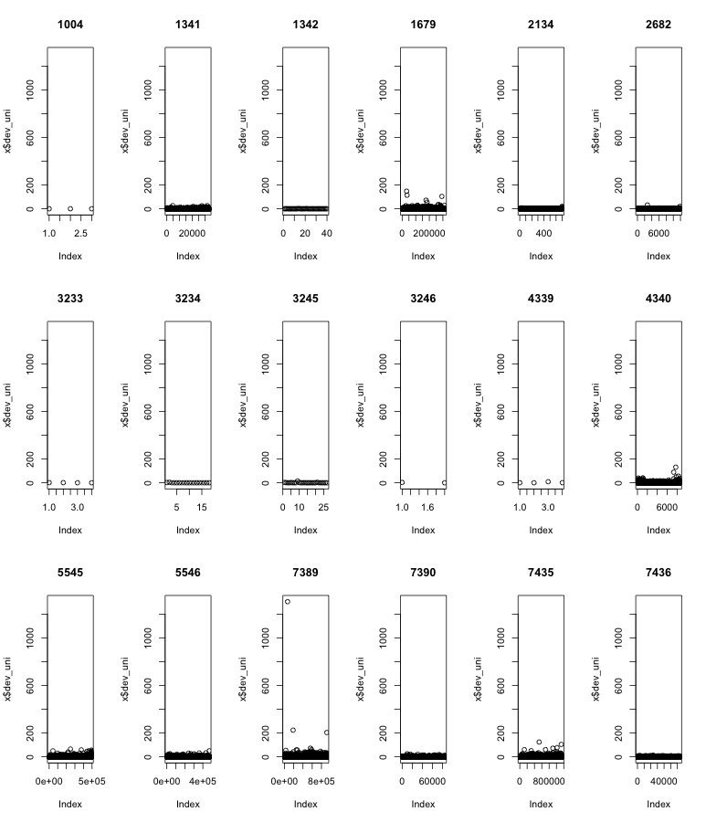
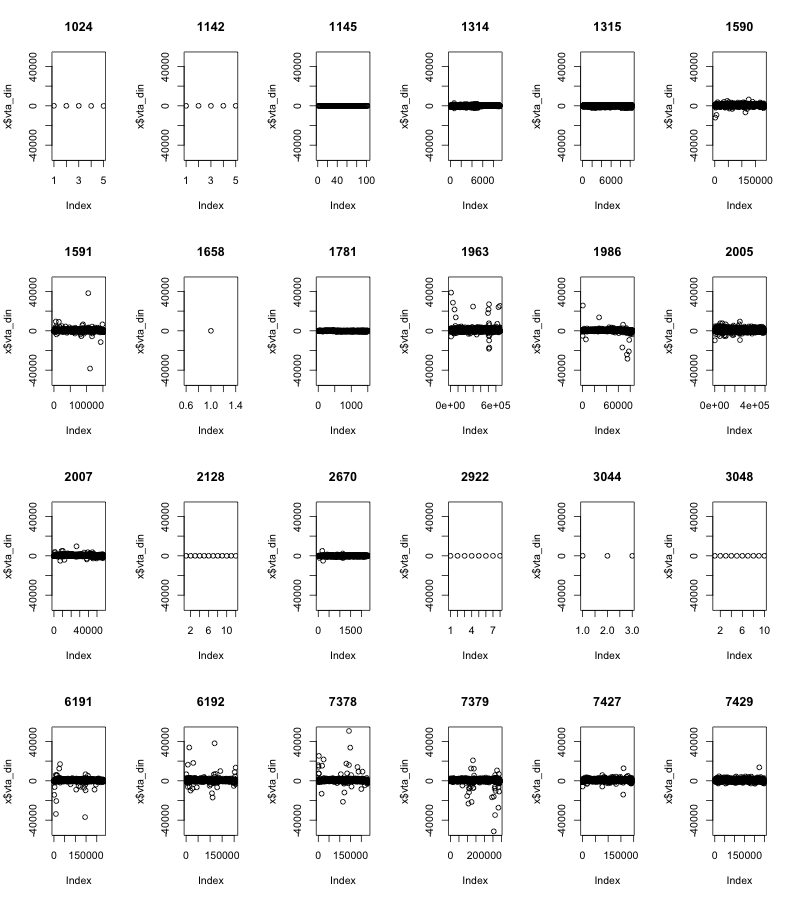

% 16-oct-2013
% Exploración del conjunto de datos que tenemos de la zona norte de pepsi.
% Makefile: pandoc -s -V geometry:margin=0.7in -V lang=spanish 1_exploratorio.md -o Exploratorio.pdf

Sólo vamos a utilizar los datos de SalesDataYYYYXXX.txt porque vamos a intentar aproximar inventarios.
Antes de hacer modelos para ver wtf, hay que ver si hay sobre o subdistribución. Pero antes, exploración de datos. David hizo una selección de tres productos: churrumais, fritos y papas normales.

**Las notas mentales están en negritas**


Prueba con sólo un archivo
--------------------------------------------------------------------------------------------------

- 1: CUSTKEY_CUSTNUMBER - 830I000000002
- 2: COD_BARRAS, - N/A todos
- 3: PRO.ID_PROD_ODS, - 0436
- 4: CALENDARDATE, - 2012-03-16
- 5: CURRENCY, - PESOS
- 6: MEDIDA, - EACH
- 7: VENTA_CAPT_PES, --> SALESAMOUNT – 1720.0000
- 8: VENTA_CAPT_UNI, --> SALESQUANTITY – 50.0000
- 9: DEVOL_PES, --> UNSALEABLEAMOUNT – 0.0000
- 10: DEVOL_UNI    --> UNSALEABLEQUANTITY  - 106
- 11: RUT.ID_RUTA

**Hay que borrar el campo 2 de código de barras; nomás estorba.**
**También el de moneda y medida, a menos que cambien**

Churrumais
--------------------------------------------------------------------------------------------------


```r
setwd("/Users/PandoraMac/Documents/David/pepsi2/Datos Norte 3 papitas/")
nombres<-c("id_cliente","codbarr","id_prod","fecha","moneda","medida","vta_din","vta_uni","dev_din",
           "dev_uni","id_ruta")
s<-as.data.frame(read.table("churrumais.dat", sep="|",header=FALSE,
                 colClasses=c(rep("character",6),rep("numeric",4),"integer")))
names(s)<-nombres
head(s)

     id_cliente codbarr id_prod      fecha moneda medida vta_din vta_uni dev_din dev_uni id_ruta
1 812I000006834     N/A    2134 2012-01-03  PESOS   EACH   37.95      15       0       0   20682
2 818I000005674     N/A    5545 2012-01-05  PESOS   EACH   30.33       9       0       0    3011
3 830I000000268     N/A    5545 2012-01-05  PESOS   EACH   33.70      10       0       0   12158
4 830I000001218     N/A    5545 2012-01-05  PESOS   EACH   67.40      20       0       0   14596
5 804I000002354     N/A    5545 2012-01-06  PESOS   EACH   16.85       5       0       0    8136
6 816I000008651     N/A    5545 2012-01-06  PESOS   EACH   33.70      10       0       0   11936

dim(s)
[1] 4044346      11
```


Verificación de SKUs
-------------------------------------------------------------------------------------------------------
**Tenemos todos los sku's que corresponden a churrumais. Necesito ver que sean todos chicos**


```r
#setwd("/Users/PandoraMac/Documents/David/pepsi2/Datos Norte 3 papitas/")
#nombres<-c("id_cliente","codbarr","id_prod","fecha","moneda","medida","vta_din","vta_uni","dev_din",
#           "dev_uni","id_ruta")
#s<-as.data.frame(read.table("churrumais.dat", sep="|",header=FALSE,
#                 colClasses=c(rep("character",6),rep("numeric",4),"integer")))
#names(s)<-nombres

prod<-as.data.frame(read.table("productos_sal.txt", sep="|", quote="", header=FALSE,fill=TRUE,stringsAsFactors = FALSE,colClasses=rep("character",8)))

dim(prod)
[1] 3086    8

subset(prod,V2%in%names(sort(table(s$id_prod),decreasing=TRUE)))
      V1   V2            V3 V4    V5 V6         V7                V8
245  N/A 3245 SAVORY SNACKS  2 CHICO 93 CHURRUMAIS        CHURRUMAIS
246  N/A 3246 SAVORY SNACKS  2 CHICO 93 CHURRUMAIS        CHURRUMAIS
288  N/A 1679 SAVORY SNACKS  2 CHICO 93 CHURRUMAIS        CHURRUMAIS
366  N/A 5545 SAVORY SNACKS  2 CHICO 93 CHURRUMAIS        CHURRUMAIS
438  N/A 5546 SAVORY SNACKS  2 CHICO 93 CHURRUMAIS        CHURRUMAIS
486  N/A 7389 SAVORY SNACKS  2 CHICO 93 CHURRUMAIS        CHURRUMAIS
540  N/A 7390 SAVORY SNACKS  2 CHICO 93 CHURRUMAIS        CHURRUMAIS
548  N/A 7435 SAVORY SNACKS  2 CHICO 93 CHURRUMAIS        CHURRUMAIS
728  N/A 1341 SAVORY SNACKS  2 CHICO 93 CHURRUMAIS        CHURRUMAIS
729  N/A 1342 SAVORY SNACKS  2 CHICO 93 CHURRUMAIS        CHURRUMAIS
1167 N/A 3234 SAVORY SNACKS  2 CHICO 93 CHURRUMAIS        CHURRUMAIS
1292 N/A 2682 SAVORY SNACKS  2 CHICO 93 CHURRUMAIS        CHURRUMAIS
1304 N/A 1344 SAVORY SNACKS  2 CHICO 93 CHURRUMAIS CHURRUMAIS FLAMAS
1695 N/A 4597 SAVORY SNACKS  2 CHICO 93 CHURRUMAIS CHURRUMAIS FLAMAS
1879 N/A 7436 SAVORY SNACKS  2 CHICO 93 CHURRUMAIS        CHURRUMAIS
2115 N/A 4340 SAVORY SNACKS  2 CHICO 93 CHURRUMAIS        CHURRUMAIS
2117 N/A 4339 SAVORY SNACKS  2 CHICO 93 CHURRUMAIS        CHURRUMAIS
2292 N/A 1004 SAVORY SNACKS  2 CHICO 93 CHURRUMAIS        CHURRUMAIS
2599 N/A 3233 SAVORY SNACKS  2 CHICO 93 CHURRUMAIS        CHURRUMAIS
2677 N/A 2134 SAVORY SNACKS  2 CHICO 93 CHURRUMAIS        CHURRUMAIS
2853 N/A 1343 SAVORY SNACKS  2 CHICO 93 CHURRUMAIS CHURRUMAIS FLAMAS
3071 N/A 4607 SAVORY SNACKS  2 CHICO 93 CHURRUMAIS CHURRUMAIS FLAMAS
3072 N/A 4622 SAVORY SNACKS  2 CHICO 93 CHURRUMAIS CHURRUMAIS FLAMAS
3080 N/A 4576 SAVORY SNACKS  2 CHICO 93 CHURRUMAIS CHURRUMAIS FLAMAS
```


Hay que matar los churrumais flamas: c(1344,4597,1343,4607,4622,4576)

```r
datos <- subset(s, id_prod %in% c("3245", "3246", "1679", "5545", "5546", "7389", 
    "7390", "7435", "1341", "1342", "3234", "2682", "7436", "4340", "4339", 
    "1004", "3233", "2134"))
rm(s)
```


Tables y plots
-------------------------------------------------------------------------------------------------------


```r
length(table(datos$id_cliente))
[1] 124,764
length(table(datos$codbarr))
[1] 1
length(table(datos$id_prod))
[1] 18
length(table(datos$fecha))
[1] 539
length(table(datos$moneda))
[1] 1
length(table(datos$medida))
[1] 1
length(table(datos$id_ruta))
[1] 1898
> summary(datos$vta_din)
     Min.   1st Qu.    Median      Mean   3rd Qu.      Max. 
-53170.00     16.85     21.10     29.97     33.70  69430.00 
> summary(datos$vta_uni)
      Min.    1st Qu.     Median       Mean    3rd Qu.       Max. 
-14190.000      4.000      5.000      7.926      9.000  16450.000 
> summary(datos$dev_din)
    Min.  1st Qu.   Median     Mean  3rd Qu.     Max. 
   0.000    0.000    0.000    0.041    0.000 4398.000 
> summary(datos$dev_uni)
     Min.   1st Qu.    Median      Mean   3rd Qu.      Max. 
   0.0000    0.0000    0.0000    0.0162    0.0000 1305.0000  
```


**Ventas negativas!?!?**

**Para esto quizá tampoco necesitemos las rutas; en bash podríamos tbn quitar esa columna**


Plots:


```r
par(mfrow = c(2, 2))
plot(table(datos$vta_din), main = "Ventas en dinero")
plot(table(datos$vta_uni), main = "Ventas en unidades")
plot(table(datos$dev_din), main = "Devoluciones dinero")
plot(table(datos$dev_uni), main = "Devoluciones unidades")
par(mfrow = c(1, 1))
```


Plots de las ventas y devoluciones versus las otras cosas


```r
par(mfrow = c(3, 6))
myfunction <- function(x) {
    plot(x$vta_din, ylim = c(min(datos$vta_din), max(datos$vta_din)), main = x$id_prod[1])
}
by(datos, datos$id_prod, myfunction)
par(mfrow = c(1, 1))
```


```r
par(mfrow = c(3, 6))
myfunction <- function(x) {
    plot(x$dev_uni, ylim = c(min(datos$dev_uni), max(datos$dev_uni)), main = x$id_prod[1])
}
by(datos, datos$id_prod, myfunction)
par(mfrow = c(1, 1))
```





Fritos
--------------------------------------------------------------------------------------------------


```r
setwd("/Users/PandoraMac/Documents/David/pepsi2/Datos Norte 3 papitas/")
nombres<-c("id_cliente","codbarr","id_prod","fecha","moneda","medida","vta_din","vta_uni","dev_din",
           "dev_uni","id_ruta")
s<-as.data.frame(read.table("fritos.dat", sep="|",header=FALSE,
                 colClasses=c(rep("character",6),rep("numeric",4),"integer")))
names(s)<-nombres
head(s)

     id_cliente codbarr id_prod      fecha moneda medida vta_din vta_uni dev_din dev_uni id_ruta
1 814I000000214     N/A    1314 2012-01-05  PESOS   EACH    5.06       1       0       0     860
2 814I000014599     N/A    1314 2012-01-03  PESOS   EACH   50.60      10       0       0    7064
3 845I000004658     N/A    1314 2011-12-31  PESOS   EACH   50.60      10       0       0   11883
4 825I000009614     N/A    1314 2012-01-03  PESOS   EACH   45.54       9       0       0    5071
5 811I000013776     N/A    1314 2012-01-04  PESOS   EACH   60.72      12       0       0    6923
6 824I000000786     N/A    1314 2012-01-03  PESOS   EACH   25.30       5       0       0    6130

dim(s)
[1] 3054426      11
```


Verificación de SKUs
-------------------------------------------------------------------------------------------------------
**Tenemos todos los sku's que corresponden a churrumais. Necesito ver que sean todos chicos**


```r
#setwd("/Users/PandoraMac/Documents/David/pepsi2/Datos Norte 3 papitas/")
#nombres<-c("id_cliente","codbarr","id_prod","fecha","moneda","medida","vta_din","vta_uni","dev_din",
#           "dev_uni","id_ruta")
#s<-as.data.frame(read.table("churrumais.dat", sep="|",header=FALSE,
#                 colClasses=c(rep("character",6),rep("numeric",4),"integer")))
#names(s)<-nombres

prod<-as.data.frame(read.table("productos_sal.txt", sep="|", quote="", header=FALSE,fill=TRUE,stringsAsFactors = FALSE,colClasses=rep("character",8)))

dim(prod)
[1] 3086    8

subset(prod,V2%in%names(sort(table(s$id_prod),decreasing=TRUE)))
      V1   V2            V3 V4    V5 V6         V7                V8
195  N/A 1145 SAVORY SNACKS  2 CHICO 93  FRITOS      FRITOS SAL
367  N/A 6192 SAVORY SNACKS  2 CHICO 93  FRITOS      FRITOS SAL
501  N/A 7427 SAVORY SNACKS  2 CHICO 93  FRITOS      FRITOS SAL
502  N/A 7434 SAVORY SNACKS  2 CHICO 93 DORITOS DORITOS INFERNO
536  N/A 7378 SAVORY SNACKS  2 CHICO 93  FRITOS      FRITOS SAL
537  N/A 7379 SAVORY SNACKS  2 CHICO 93  FRITOS      FRITOS SAL
545  N/A 7429 SAVORY SNACKS  2 CHICO 93  FRITOS      FRITOS SAL
645  N/A 1314 SAVORY SNACKS  2 CHICO 93  FRITOS      FRITOS SAL
661  N/A 1781 SAVORY SNACKS  2 CHICO 93  FRITOS      FRITOS SAL
842  N/A 3044 SAVORY SNACKS  2 CHICO 93  FRITOS      FRITOS SAL
844  N/A 3048 SAVORY SNACKS  2 CHICO 93  FRITOS      FRITOS SAL
1199 N/A 2128 SAVORY SNACKS  2 CHICO 93  FRITOS      FRITOS SAL
1217 N/A 1590 SAVORY SNACKS  2 CHICO 93  FRITOS      FRITOS SAL
1218 N/A 1591 SAVORY SNACKS  2 CHICO 93  FRITOS      FRITOS SAL
1282 N/A 2670 SAVORY SNACKS  2 CHICO 93  FRITOS      FRITOS SAL
1643 N/A 1024 SAVORY SNACKS  2 CHICO 93  FRITOS      FRITOS SAL
1750 N/A 2922 SAVORY SNACKS  2 CHICO 93  FRITOS      FRITOS SAL
1907 N/A 1986 SAVORY SNACKS  2 CHICO 93  FRITOS      FRITOS SAL
1910 N/A 2005 SAVORY SNACKS  2 CHICO 93  FRITOS      FRITOS SAL
1920 N/A 2007 SAVORY SNACKS  2 CHICO 93  FRITOS      FRITOS SAL
1928 N/A 1963 SAVORY SNACKS  2 CHICO 93  FRITOS      FRITOS SAL
2374 N/A 1142 SAVORY SNACKS  2 CHICO 93  FRITOS      FRITOS SAL
2639 N/A 6191 SAVORY SNACKS  2 CHICO 93  FRITOS      FRITOS SAL
2686 N/A 1315 SAVORY SNACKS  2 CHICO 93  FRITOS      FRITOS SAL
```


Hay que matar los churrumais flamas: c(1344,4597,1343,4607,4622,4576)

```r
datos <- s[s$id_prod != "7434", ]
rm(s)
```


Tables y plots
-------------------------------------------------------------------------------------------------------


```r
length(table(datos$id_cliente))
[1] 120,153
length(table(datos$codbarr))
[1] 1
length(table(datos$id_prod))
[1] 24
length(table(datos$fecha))
[1] 539
length(table(datos$moneda))
[1] 1
length(table(datos$medida))
[1] 1
length(table(datos$id_ruta))
[1] 1881
> summary(datos$vta_din)
     Min.   1st Qu.    Median      Mean   3rd Qu.      Max. 
-51370.00     15.18     25.30     30.25     30.36  50640.00 
> summary(datos$vta_uni)
      Min.    1st Qu.     Median       Mean    3rd Qu.       Max. 
-10150.000      3.000      5.000      5.984      6.000  10010.000 
> summary(datos$dev_din)
     Min.   1st Qu.    Median      Mean   3rd Qu.      Max. 
 -8.00000   0.00000   0.00000   0.08582   0.00000 225.00000 
> summary(datos$dev_uni)
    Min.  1st Qu.   Median     Mean  3rd Qu.     Max. 
0.00e+00 0.00e+00 0.00e+00 2.66e-02 0.00e+00 1.04e+03 
```


**Ventas negativas!?!?**

**Para esto quizá tampoco necesitemos las rutas; en bash podríamos tbn quitar esa columna**


Plots:


```r
par(mfrow = c(2, 2))
plot(table(datos$vta_din), main = "Ventas en dinero")
plot(table(datos$vta_uni), main = "Ventas en unidades")
plot(table(datos$dev_din), main = "Devoluciones dinero")
plot(table(datos$dev_uni), main = "Devoluciones unidades")
par(mfrow = c(1, 1))
```


Plots de las ventas y devoluciones versus las otras cosas


```r
par(mfrow = c(4, 6))
myfunction <- function(x) {
    plot(x$vta_din, ylim = c(min(datos$vta_din), max(datos$vta_din)), main = x$id_prod[1])
}
by(datos, datos$id_prod, myfunction)
par(mfrow = c(1, 1))
```





```r
par(mfrow = c(4, 6))
myfunction <- function(x) {
    plot(x$dev_uni, ylim = c(min(datos$dev_uni), max(datos$dev_uni)), main = x$id_prod[1])
}
by(datos, datos$id_prod, myfunction)
par(mfrow = c(1, 1))
```


