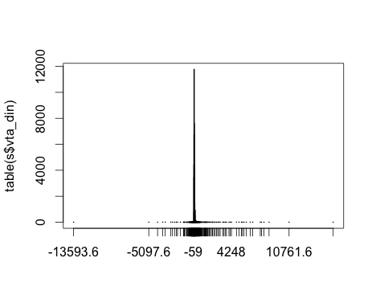
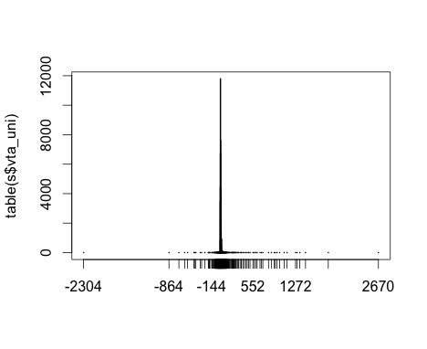
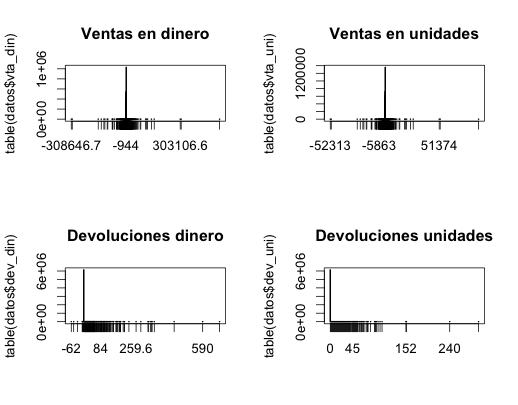
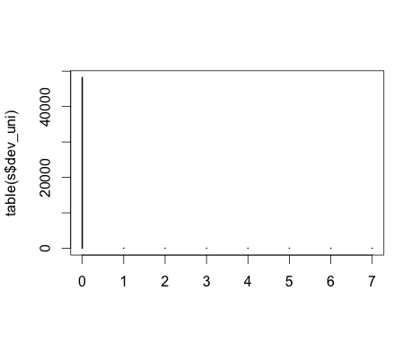
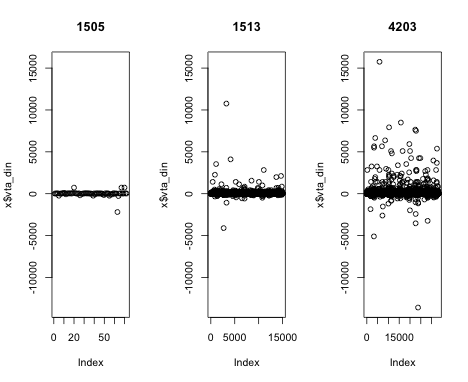

% 17-oct-2013
% Cálculo de inventarios para clientes agrupados por tipo para el conjunto de datos que tenemos de la zona norte de pepsi.
% Makefile: pandoc -s -V geometry:margin=0.7in -V lang=spanish 2_inventarios.md -o Inventarios.pdf


Sólo vamos a utilizar los datos de SalesDataYYYYXXX.txt porque vamos a intentar aproximar inventarios.
Antes de hacer modelos para ver wtf, hay que ver si hay sobre o subdistribución. 

De la exploración tenemos que:
**Hay que borrar el campo 2 de código de barras; nomás estorba.**
**También el de moneda y medida, a menos que cambien**
**Ventas negativas y devoluciones negativas!?!?**
**Para esto quizá tampoco necesitemos las rutas; en bash podríamos tbn quitar esa columna**
**Elegimos 4203 (SABRITAS SAL), 2633 (SABRITAS FLAMIN HOT), 1513 (SABRITAS CREMA Y ESPECIAS).**

```
for f in SF_ExtSalesData*
do
grep "|4203|" $f >> sales4203.txt;
grep "|2633|" $f >> sales2633.txt; 
grep "|1513|" $f >> sales1513.txt; 
echo $f;
done
```

```
PandoraMac@MacBook-Air-de-Jessica:~/Documents/David/pepsi2/DatosNorte$ wc -l sales1513.txt
  229,934 sales1513.txt
PandoraMac@MacBook-Air-de-Jessica:~/Documents/David/pepsi2/DatosNorte$ wc -l sales2633.txt
  175,041 sales2633.txt
PandoraMac@MacBook-Air-de-Jessica:~/Documents/David/pepsi2/DatosNorte$ wc -l sales4203.txt
  479,702 sales4203.txt
```


Con todos los archivos para tres sku's
--------------------------------------------------------------------------------------------------

- 1: CUSTKEY_CUSTNUMBER - 830I000000002
- 2: COD_BARRAS, - N/A todos
- 3: PRO.ID_PROD_ODS, - 0436
- 4: CALENDARDATE, - 2012-03-16
- 5: CURRENCY, - PESOS
- 6: MEDIDA, - EACH
- 7: VENTA_CAPT_PES, --> SALESAMOUNT – 1720.0000
- 8: VENTA_CAPT_UNI, --> SALESQUANTITY – 50.0000
- 9: DEVOL_PES, --> UNSALEABLEAMOUNT – 0.0000
- 10: DEVOL_UNI    --> UNSALEABLEQUANTITY  - 106
- 11: RUT.ID_RUTA

sales1513.txt
sales2633.txt
sales4203.txt

**Elegimos 4203 (SABRITAS SAL), 2633 (SABRITAS FLAMIN HOT), 1513 (SABRITAS CREMA Y ESPECIAS).**

```{r,eval=FALSE}
setwd("/Users/PandoraMac/Documents/David/pepsi2/DatosNorte/")
nombres<-c("id_cliente","codbarr","id_prod","fecha","moneda","medida","vta_din","vta_uni","dev_din",
           "dev_uni","id_ruta")
cye<-as.data.frame(read.table("sales1513.txt", sep="|",header=FALSE,
                 colClasses=c(rep("character",6),rep("numeric",4),"integer")))
ss<-as.data.frame(read.table("sales4203.txt", sep="|",header=FALSE,
                 colClasses=c(rep("character",6),rep("numeric",4),"integer")))
fh<-as.data.frame(read.table("sales2633.txt", sep="|",header=FALSE,
                 colClasses=c(rep("character",6),rep("numeric",4),"integer")))
names(cye)<-names(ss)<-names(fh)<-nombres

> length(table(ss$fecha))
[1] 234
> length(table(fh$fecha))
[1] 199
> length(table(cye$fecha))
[1] 208

sort(names(table(cye$fecha)),decreasing=FALSE)

max(table(cye$id_cliente,cye$fecha))
table(table(cye$id_cliente,cye$fecha))

```


Tables simples
-------------------------------------------------------------------------------------------------------

```{r,eval=FALSE}
length(table(s$id_cliente))
[1] 111,496
length(table(s$codbarr))
[1] 1
length(table(s$id_prod))
[1] 980
length(table(s$fecha))
[1] 6
length(table(s$moneda))
[1] 1
length(table(s$medida))
[1] 1
length(table(s$id_ruta))
[1] 2085
summary(s$vta_din)
     Min.   1st Qu.    Median      Mean   3rd Qu.      Max. 
-236200.0      20.2      29.5      52.6      47.2  320000.0 
summary(s$vta_uni)
     Min.   1st Qu.    Median      Mean   3rd Qu.      Max. 
-25560.00      4.00      5.00     10.35     10.00  63240.00 
summary(s$dev_din)
    Min.  1st Qu.   Median     Mean  3rd Qu.     Max. 
  -6.000    0.000    0.000    0.165    0.000 5849.000 
summary(s$dev_uni)
    Min.  1st Qu.   Median     Mean  3rd Qu.     Max. 
  0.0000   0.0000   0.0000   0.0282   0.0000 422.0000 
```

**Ventas negativas y devoluciones negativas!?!?**

**Para esto quizá tampoco necesitemos las rutas; en bash podríamos tbn quitar esa columna**

**Otra vez tenemos un montón de productos... No eran sólo tres skus?**

```
PandoraMac@MacBook-Air-de-Jessica:~/Documents/David/pepsi2/DatosNorte$ grep "0191" SF_ExtProductData.txt
N/A|019102|BISCUITS|1|INDIVIDUAL|106|FLORENTINAS|FLORENTINAS FRESA
N/A|PT000191|PMF_UNALLOCATED|3|PMF_UNALLOCATED|-1|PMF_UNALLOCATED|PMF_UNALLOCATED
N/A|019101|BISCUITS|1|PMF_UNALLOCATED|-1|POPULARES|POPULARES
N/A|0191|SAVORY SNACKS|2|CHICO|93|SABRITAS PC|SABRITAS LIMON
N/A|019100|BISCUITS|1|INDIVIDUAL|106|FLORENTINAS|FLORENTINAS FRESA

PandoraMac@MacBook-Air-de-Jessica:~/Documents/David/pepsi2/DatosNorte$ grep "0503" SF_ExtProductData.txt
N/A|0503|CONFECTIONERY & NB|5|SINGLE SERVE|125|SONRICS GUM|BOMBIUX OTE
N/A|GT_3050301|PMF_UNALLOCATED|3|PMF_UNALLOCATED|-1|PMF_UNALLOCATED|PMF_UNALLOCATED
N/A|120503|FOODS|4|BOXES|4|AZUCARADAS|AZUCARADAS CLASICA
N/A|210503|BISCUITS|1|INDIVIDUAL|106|EMPERADOR|EMPERADOR COMBINADO
N/A|540503|PMF_UNALLOCATED|3|PMF_UNALLOCATED|-1|PMF_UNALLOCATED|PMF_UNALLOCATED
N/A|170503|FOODS|4|BOXES|4|SORIANA|CORN FLAKES SORIANA
N/A|360503|PMF_UNALLOCATED|3|PMF_UNALLOCATED|-1|PMF_UNALLOCATED|PMF_UNALLOCATED
N/A|050300|BISCUITS|1|SINGLE SERVE|2|SURTIDO PAKETINES|PAKETINES VARIOS
N/A|370503|PMF_UNALLOCATED|3|PMF_UNALLOCATED|-1|PMF_UNALLOCATED|PMF_UNALLOCATED
N/A|080503|PMF_UNALLOCATED|3|PMF_UNALLOCATED|-1|PMF_UNALLOCATED|PMF_UNALLOCATED
```

Hay que ver qué onda con los productos. Espiando SF_ExtProductData.txt, resulta que todas las papitas 
dicen _SAVORY SNACKS_ así que:

```
PandoraMac@MacBook-Air-de-Jessica:~/Documents/David/pepsi2/DatosNorte$ 
grep "SAVORY SNACKS" SF_ExtProductData.txt >> productos_sal.txt
PandoraMac@MacBook-Air-de-Jessica:~/Documents/David/pepsi2/DatosNorte$ head productos_sal.txt 
N/A|0625|SAVORY SNACKS|2|CHICO|93|RUFFLES|RUFFLES SAL
N/A|0626|SAVORY SNACKS|2|CHICO|93|RUFFLES|RUFFLES QUESO
N/A|0628|SAVORY SNACKS|2|CHICO|93|RUFFLES|RUFFLES CHILE Y LIMON
N/A|0629|SAVORY SNACKS|2|CHICO|93|RUFFLES|RUFFLES SAL
N/A|0631|SAVORY SNACKS|2|Chico|12|RUFFLES|RUFFLES CREMA ESPECIAS
N/A|0632|SAVORY SNACKS|2|CHICO|93|RUFFLES|RUFFLES CHILE Y LIMON
N/A|2204|SAVORY SNACKS|2|BOTE GRANDE|88|STAX|STAX ORIGINAL
N/A|2206|SAVORY SNACKS|2|BOTE GRANDE|88|STAX|STAX SOUR & CREAM
N/A|3741|SAVORY SNACKS|2|EXH 0-50|42|OT SALADO|OT SALADO
N/A|2102|SAVORY SNACKS|2|PAQUETE|119|PAQUETES SALADO|PAQUETES SALADO
PandoraMac@MacBook-Air-de-Jessica:~/Documents/David/pepsi2/DatosNorte$ wc -l productos_sal.txt 
    3086 productos_sal.txt
```

Hay diferentes tamaños... Podemos concentrarnos en las chicas:
```
PandoraMac@MacBook-Air-de-Jessica:~/Documents/David/pepsi2/DatosNorte$ 
grep "CHICO" productos_sal.txt >> productos_sal_ch.txt
PandoraMac@MacBook-Air-de-Jessica:~/Documents/David/pepsi2/DatosNorte$ wc -l productos_sal_ch.txt 
    1197 productos_sal_ch.txt
```


Selección de productos
-------------------------------------------------------------------------------------------------------

Cuáles queremos? Me mato... Podríamos ver cuáles son los que tienen más ventas para este archivo.
Hagamos el subset de las papitas y veamos q onda. De ahí elegimos tres sku's y filtramos todos los archivos que leamos, ya que se haga en serio.

```{r,eval=FALSE}
#setwd("/Users/PandoraMac/Documents/David/pepsi2/DatosNorte/")
#nombres<-c("id_cliente","codbarr","id_prod","fecha","moneda","medida","vta_din","vta_uni","dev_din",
           "dev_uni","id_ruta")
#s<-as.data.frame(read.table("SF_ExtSalesData2012011 copia.txt", sep="|",header=FALSE,
                 colClasses=c(rep("character",6),rep("numeric",4),"integer")))
#names(s)<-nombres

prod<-as.data.frame(read.table("productos_sal_ch.txt", sep="|", quote="", header=FALSE,fill=TRUE,stringsAsFactors = FALSE,colClasses=rep("character",8)))
datos<-subset(s,is.element(s$id_prod,prod[,2]))
dim(datos)
[1] 1509770      11
dim(prod)
[1] 1197    8
rm(s)
#sort(table(datos$id_prod),decreasing=TRUE)[1:20]
subset(prod,V2%in%names(sort(table(datos$id_prod),decreasing=TRUE)[1:20]))
338  N/A 6002 SAVORY SNACKS  2 CHICO 93       DORITOS           DORITOS NACHO
626  N/A 1760 SAVORY SNACKS  2 CHICO 93      TOSTITOS    TOSTITOS SALSA VERDE
663  N/A 1786 SAVORY SNACKS  2 CHICO 93 CHEETOS FRIED      CHEETOS TORCIDITOS
664  N/A 1787 SAVORY SNACKS  2 CHICO 93 CHEETOS FRIED          CHEETOS NACHOS
666  N/A 1791 SAVORY SNACKS  2 CHICO 93 CHEETOS BAKED           CHEETOS POFFS
668  N/A 1413 SAVORY SNACKS  2 CHICO 93 CHEETOS FRIED      CHEETOS TORCIDITOS
670  N/A 1417 SAVORY SNACKS  2 CHICO 93 CHEETOS BAKED           CHEETOS POFFS
672  N/A 1502 SAVORY SNACKS  2 CHICO 93 CHEETOS FRIED      CHEETOS FLAMIN HOT
953  N/A 1789 SAVORY SNACKS  2 CHICO 93 CHEETOS BAKED         CHEETOS BOLITAS
1129 N/A 1509 SAVORY SNACKS  2 CHICO 93       DORITOS           DORITOS NACHO
1130 N/A 1510 SAVORY SNACKS  2 CHICO 93       DORITOS DORITOS SALSA INCOGNITA
1158 N/A 1477 SAVORY SNACKS  2 CHICO 93      PAKETAXO                PAKETAXO
1194 N/A 1446 SAVORY SNACKS  2 CHICO 93   SABRITAS PC            SABRITAS SAL
1195 N/A 1448 SAVORY SNACKS  2 CHICO 93   SABRITAS PC       SABRITAS ADOBADAS
1473 N/A 1356 SAVORY SNACKS  2 CHICO 93       POFFETS                 POFFETS
1535 N/A 4203 SAVORY SNACKS  2 CHICO 93   SABRITAS PC            SABRITAS SAL
1537 N/A 4205 SAVORY SNACKS  2 CHICO 93   SABRITAS PC       SABRITAS ADOBADAS
2236 N/A 4208 SAVORY SNACKS  2 CHICO 93       RUFFLES           RUFFLES QUESO
2784 N/A 3281 SAVORY SNACKS  2 CHICO 93       RUFFLES           RUFFLES QUESO
2839 N/A 1759 SAVORY SNACKS  2 CHICO 93      TOSTITOS     TOSTITOS FLAMIN HOT

subset(prod,V2%in%names(sort(table(datos$id_prod),decreasing=TRUE)[100:120]))
      V1   V2            V3 V4    V5 V6            V7                      V8
118  N/A 2587 SAVORY SNACKS  2 CHICO 93      PAKETAXO                PAKETAXO
279  N/A 1318 SAVORY SNACKS  2 CHICO 93        FRITOS       FRITOS ADOBADITOS
283  N/A 1326 SAVORY SNACKS  2 CHICO 93      CRUJITOS     CRUJITOS FLAMIN HOT
297  N/A 1788 SAVORY SNACKS  2 CHICO 93 CHEETOS FRIED      CHEETOS FLAMIN HOT
309  N/A 1806 SAVORY SNACKS  2 CHICO 93       RUFFLES      RUFFLES FLAMIN HOT
325  N/A 3075 SAVORY SNACKS  2 CHICO 93    SABRITONES              SABRITONES
355  N/A 2959 SAVORY SNACKS  2 CHICO 93       RUFFLES           RUFFLES QUESO
366  N/A 3033 SAVORY SNACKS  2 CHICO 93       DORITOS DORITOS SALSA INCOGNITA
423  N/A 2574 SAVORY SNACKS  2 CHICO 93       DORITOS           DORITOS CHILE
480  N/A 2926 SAVORY SNACKS  2 CHICO 93       POFFETS                 POFFETS
518  N/A 1400 SAVORY SNACKS  2 CHICO 93       DORITOS            DORITOS TORO
582  N/A 1824 SAVORY SNACKS  2 CHICO 93       DORITOS      DORITOS LATE NIGHT
616  N/A 2929 SAVORY SNACKS  2 CHICO 93      CRUJITOS                CRUJITOS
692  N/A 2930 SAVORY SNACKS  2 CHICO 93 CHEETOS FRIED      CHEETOS TORCIDITOS
773  N/A 3085 SAVORY SNACKS  2 CHICO 93      CRUJITOS     CRUJITOS FLAMIN HOT
899  N/A 0434 SAVORY SNACKS  2 CHICO 93       RUFFLES  RUFFLES CREMA ESPECIAS
915  N/A 2808 SAVORY SNACKS  2 CHICO 93 CHEETOS BAKED       CHEETOS COLMILLOS
1009 N/A 1254 SAVORY SNACKS  2 CHICO 93       RUFFLES      RUFFLES FLAMIN HOT
1014 N/A 1309 SAVORY SNACKS  2 CHICO 93       RUFFLES             RUFFLES SAL
1068 N/A 3009 SAVORY SNACKS  2 CHICO 93       RUFFLES           RUFFLES QUESO

subset(prod,V2%in%names(sort(table(datos$id_prod),decreasing=TRUE)[150:170]))
      V1   V2            V3 V4    V5 V6            V7                      V8
58   N/A 4252 SAVORY SNACKS  2 CHICO 93     PORK RIND     CHICHARRON DE CERDO
259  N/A 4378 SAVORY SNACKS  2 CHICO 93   SABRITAS PC            SABRITAS SAL
292  N/A 1780 SAVORY SNACKS  2 CHICO 93        FRITOS            FRITOS CHILE
411  N/A 3474 SAVORY SNACKS  2 CHICO 93       RUFFLES             RUFFLES SAL
442  N/A 2136 SAVORY SNACKS  2 CHICO 93      TOSTITOS              TOSTIELOTE
517  N/A 4492 SAVORY SNACKS  2 CHICO 93      PAKETAXO                PAKETAXO
539  N/A 2670 SAVORY SNACKS  2 CHICO 93        FRITOS              FRITOS SAL
540  N/A 2671 SAVORY SNACKS  2 CHICO 93        FRITOS            FRITOS CHILE
553  N/A 3309 SAVORY SNACKS  2 CHICO 93      CRUJITOS                CRUJITOS
558  N/A 1404 SAVORY SNACKS  2 CHICO 93      TOSTITOS       TOSTITOS CRONCHOS
584  N/A 3181 SAVORY SNACKS  2 CHICO 93      TOSTITOS    TOSTITOS SALSA VERDE
817  N/A 4340 SAVORY SNACKS  2 CHICO 93    CHURRUMAIS              CHURRUMAIS
827  N/A 2976 SAVORY SNACKS  2 CHICO 93 CHEETOS FRIED          CHEETOS NACHOS
829  N/A 2978 SAVORY SNACKS  2 CHICO 93 CHEETOS BAKED           CHEETOS POFFS
837  N/A 2977 SAVORY SNACKS  2 CHICO 93 CHEETOS FRIED      CHEETOS FLAMIN HOT
877  N/A 3290 SAVORY SNACKS  2 CHICO 93   SABRITAS PC       SABRITAS ADOBADAS
1006 N/A 1783 SAVORY SNACKS  2 CHICO 93          3D S                    3DS
1038 N/A 1784 SAVORY SNACKS  2 CHICO 93      CRUJITOS                CRUJITOS
1084 N/A 1504 SAVORY SNACKS  2 CHICO 93       DORITOS DORITOS SALSA INCOGNITA
1085 N/A 1505 SAVORY SNACKS  2 CHICO 93       DORITOS       DORITOS PIZZEROLA
1096 N/A 1506 SAVORY SNACKS  2 CHICO 93       DORITOS      DORITOS FLAMIN HOT
```

Elegimos 4203 (SABRITAS SAL), 1513 (SABRITAS CREMA Y ESPECIAS), 1505 (DORITOS PIZZEROLA).

```{r,eval=FALSE}
s<-subset(datos,id_prod%in%c(4203,1513,1505))
dim(s)
[1] 48267    11
```

Plots:

```{r,eval=FALSE}
plot(table(s$vta_din))
plot(table(s$vta_uni))
plot(table(s$dev_din))
plot(table(s$dev_uni))
```







Tables simples versión 2
-------------------------------------------------------------------------------------------------------

```{r,eval=FALSE}
> length(table(s$id_cliente))
[1] 40,810
> length(table(s$codbarr))
[1] 1
> length(table(s$id_prod))
[1] 3
> length(table(s$fecha))
[1] 6
> length(table(s$moneda))
[1] 1
> length(table(s$medida))
[1] 1
> length(table(s$id_ruta))
[1] 1,305
> summary(s$vta_din)
     Min.   1st Qu.    Median      Mean   3rd Qu.      Max. 
-13590.00     23.60     29.50     46.17     47.20  15750.00 
> summary(s$vta_uni)
     Min.   1st Qu.    Median      Mean   3rd Qu.      Max. 
-2304.000     4.000     5.000     7.825     8.000  2670.000 
> summary(s$dev_din)
    Min.  1st Qu.   Median     Mean  3rd Qu.     Max. 
 0.00000  0.00000  0.00000  0.02034  0.00000 41.30000 
> summary(s$dev_uni)
    Min.  1st Qu.   Median     Mean  3rd Qu.     Max. 
0.000000 0.000000 0.000000 0.003605 0.000000 7.000000 
```


De las ventas y devoluciones versus las otras cosas

```{r,eval=FALSE}
par(mfrow=c(1,3))
myfunction<-function(x){
  plot(x$vta_din,ylim=c(min(s$vta_din),max(s$vta_din)),main=x$id_prod[1])
}
by(s,s$id_prod,myfunction)
par(mfrow=c(1,1))
```


